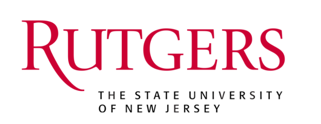
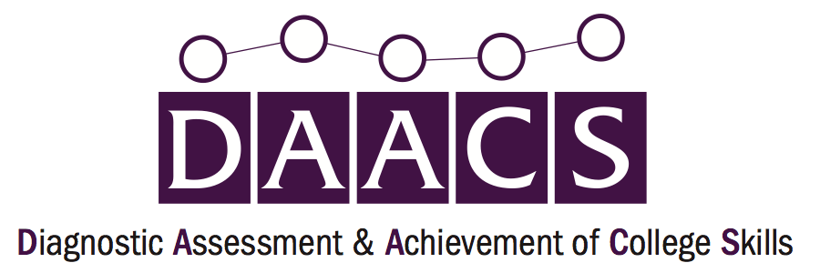
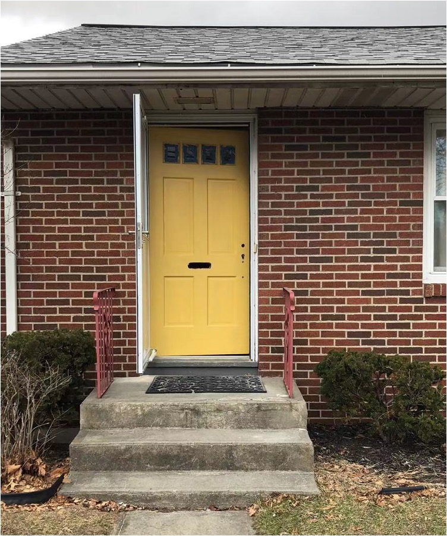
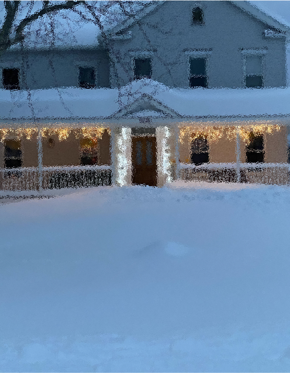
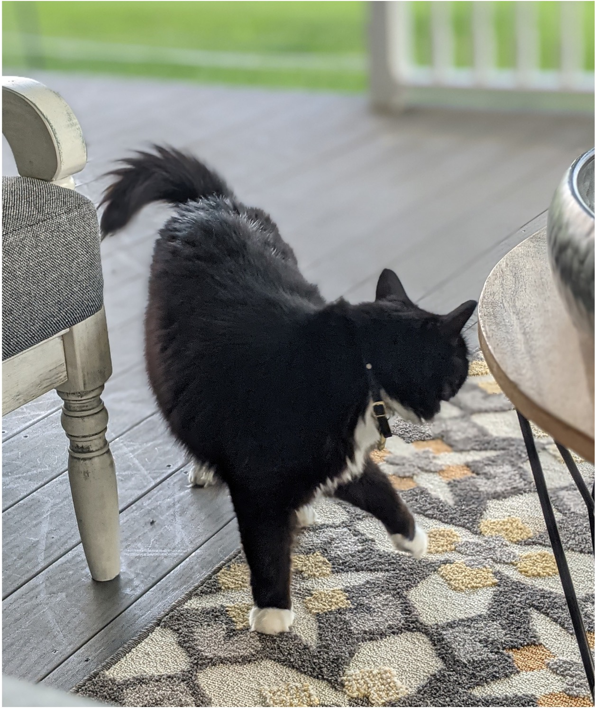
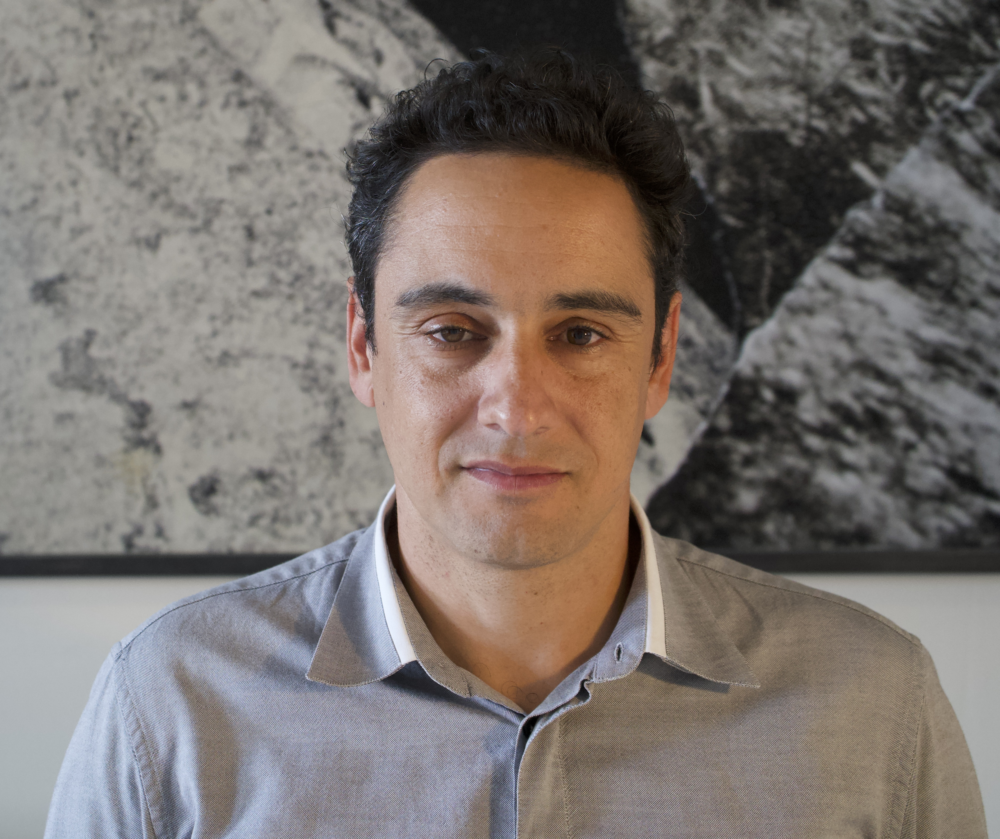
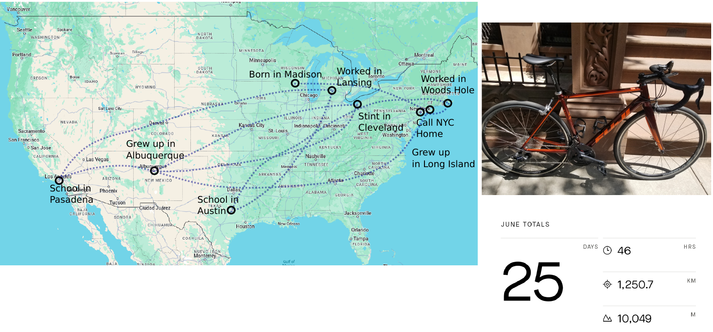
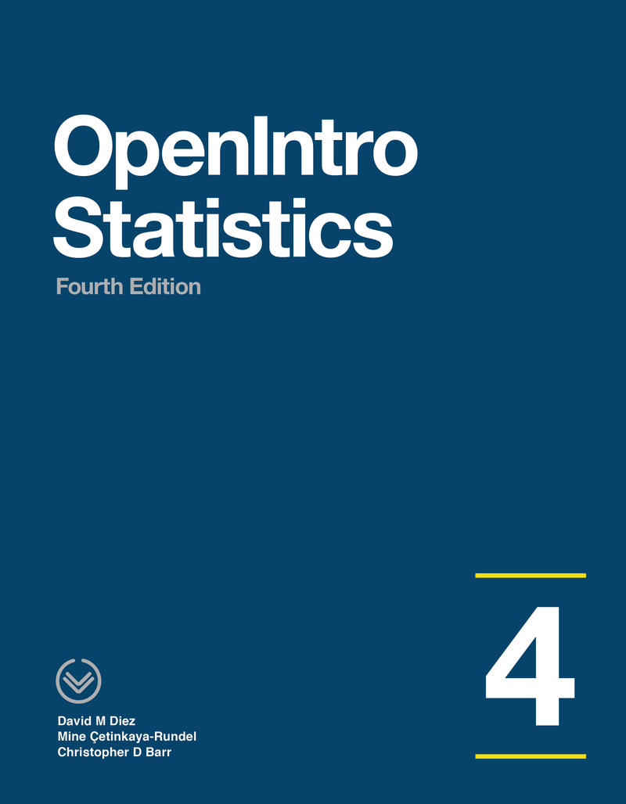

```{r setup, include = FALSE}
# Cartoons from https://github.com/allisonhorst/stats-illustrations
# dplyr based upon https://allisonhorst.shinyapps.io/dplyr-learnr/#section-welcome

source('../config.R')
```

class: center, middle, inverse, title-slide

# `r metadata$title`
## `r metadata$subtitle`
### `r metadata$author`
### `r metadata$date`


---
# Agenda

* About your instructors
* Syllabus
* Class meetups
* Course Schedule
* Assignments (how you will be graded)
	* Participation
	* Labs
	* Data Project
	* Exams
* Software
	* The `DATA606` R Package
	* Using R Markdown

---

# A little about Jason...

* Assistant Professor at CUNY in Data Science and Information Systems

* Principal Investigator for a Department of Education Grant to develop and test the Diagnostic Assessment and Achievement of College Skills ([www.DAACS.net](http://www.daacs.net))  

* Authored over a dozen R packages including:
	* [likert](http://github.com/jbryer/likert)
	* [ShinyQDA](http://github.com/jbryer/ShinyQDA)
	* [DTedit](http://github.com/jbryer/DTedit)
	* [login](http://github.com/jbryer/login)

* Specialize in propensity score methods. Three new methods/R packages developed include:
	* [multilevelPSA](http://github.com/jbryer/multilevelPSA)
	* [TriMatch](http://github.com/jbryer/TriMatch)
	* [PSAboot](http://github.com/jbryer/PSAboot)

---

# Also a Father...

```{r, out.width='65%', fig.align='center', echo=FALSE}
knitr::include_graphics('images/BoysFall2019.jpg')
```

---

# Runner...

<table border='0' width='100%'><tr><td>
<center></center>
</td><td>
<center></center>
</td></tr></table>

---

# And photographer.

```{r, out.width='80%', fig.align='center', echo=FALSE}
knitr::include_graphics('images/Sleeping_Empire.jpg')
```

---

# A little about Angela...

.pull-left[

]
.pull-right[
<center>
<br/>
<br/>
<br/>
<br/>
<br/>
<br/>
<br />
</center>
]

---

# Teaching Experience

* Introduction to Statistics in Social Sciences

* Special Issues in Testing

* Evaluation 

* Motivation in Education

* Introduction to the Psychological Processing of Schooling

* Educational Psychology in Adolescent Development

---

# Homeowner

.pull-left[

]
.pull-right[

]

---


.pull-left[

]
.pull-right[

]


---

# A little about George....

.pull-left[

- Doctoral Lecturer at CUNY SPS

- [Past research experience](https://scholar.google.com/citations?user=2La77skAAAAJ&hl=en):
  - Plasma physics and Applied Mathematics (NYU)
  - Ecology and Evolutionary Biology (Princeton)

- Have expertise and maintain active research interests in using Bayesian methods and genomic data to improve
global scale ocean and climate models

- Taught math at NYU

]
.pull-right[



]

---

# Lived all over, loves cycling



---

# Syllabus `r hexes(c('blogdown', 'rmarkdown'))`

Syllabus and course materials are here: [https://`r paste0(tolower(semester), year)`.data606.net](https://`r paste0(tolower(semester), year)`.data606.net)

The site is built using [Quarto](https://quarto.org) and hosted on [Github](https://github.com/jbryer/`r github_link`). Each page of the site has a "Edit this page" link at the bottom right, use that to start a pull request on Github.

We will use Brightspace primary for submitting assignments only. Please submit a PDF or link to the built HTML (e.g. Rpubs, [Github](http://htmlpreview.github.io/))

PDFs are preferred for the homework as there is some LaTeX formatting in the R markdown files. The `tineytex` R package helps with install LaTeX, but you can also install LaTeX using [MiKTeX](http://miktex.org) (for Windows) and [BasicTeX](http://www.tug.org/mactex/morepackages.html) (for Mac) See this page for more information: 
https://`r paste0(tolower(semester), year)`.data606.net/course-overview/software/

---
class: font90

# Meetups

We will have meetups on Wednesday evenings at 8:00pm. 

Meetups will be recorded and made available the next day on the [course website](https://spring2024.data606.net/course-overview/meetups/).

Though attending live is not strictly required, **We expect everyone to watch the lectures during the week.** I use the class meetups to convey important information and announcements. Very often I will cover some topics not in the textbook. Students who attend the meetups tend to do well on the assignments.

**One Minute Papers** - Complete the one minute paper after each Meetup (whether you watch live or watch the recordings). It should take approximately one to two minutes to complete. This allows me to 1) verify you have attended/watch the meetup and 2) get feedback about what you learned and what you may still be unclear.

.font60[

**Please note:** *Students who participate in this class with their camera on or use a profile image are agreeing to have their video or image recorded solely for the purpose of creating a record for students enrolled in the class to refer to, including those enrolled students who are unable to attend live.  If you are unwilling to consent to have your profile or video image recorded, be sure to keep your camera off and do not use a profile image. Likewise, students who un-mute during class and participate orally are agreeing to have their voices recorded.  If you are not willing to consent to have your voice recorded during class, you will need to keep your mute button activated and communicate exclusively using the "chat" feature, which allows students to type questions and comments live.*

]

---

# Schedule

```{r schedule-setup, echo=FALSE, warning=FALSE, message=FALSE}
# devtools::install_github("gadenbuie/ggweekly")
library(ggweekly)
library(rlang) # Needed for the ggweekly.R script to work
library(configr)
library(ggplot2)
library(readxl)
library(lubridate)
# library(kableExtra)

options(knitr.kable.NA = '')

semester <- 'Fall 2024'

palette <- c('#8dd3c7','#ffffb3','#bebada','#fb8072','#80b1d3','#fdb462',
			 '#b3de69','#fccde5','#d9d9d9','#bc80bd','#ccebc5','#ffed6f')

lastModified <- format(file.info('../Schedule.xlsx')[1,]$mtime, '%B %d, %Y %I:%M%p')

meetups <- read_excel('../Schedule.xlsx', sheet = 'Meetups')
meetups$day <- as.Date(meetups$Date)
meetups$label <- paste0('Meetup ', meetups$StartTime, '\n', meetups$Topic)
# meetups$label <- meetups$Topic
meetups$color <- '#4A235A'
meetups$fill <- NA

schedule <- rbind(meetups[,c('day', 'label', 'color', 'fill')])

topics <- read_excel('../Schedule.xlsx', sheet = 'Schedule')
topics$Start <- as.Date(topics$Start)
topics$End <- as.Date(topics$End)
for(i in 1:nrow(topics)) {
	schedule <- rbind(schedule, data.frame(
		day = topics[i,]$Start,
		label = paste0(topics[i,]$Topic, '\n\n\n'),
		color = '#000000',
		fill = palette[i]
	))
	dates <- seq(topics[i,]$Start, topics[i,]$End, by = 'day')[-1]
	for(j in seq_along(dates)) {
		schedule <- rbind(schedule, data.frame(
			day = dates[j],
			label = NA,
			color = NA,
			fill = palette[i]
		))
	}
}

start_day <- lubridate::floor_date(min(meetups$day), "month")
end_day <- lubridate::ceiling_date(max(meetups$day), "month") - 1
```

```{r printTopics, echo=FALSE, warning=FALSE, message=FALSE, results='asis'}
topics$Start <- format(topics$Start, format = '%A, %B %d, %Y')
topics$End <- format(topics$End, format = '%A, %B %d, %Y')
topics <- topics %>% filter(!is.na(Link)) %>% select(-Link)
knitr::kable(topics, format = 'html')
```

---

# Textbooks `r hexes(c('openintro'))`

.pull-left[

Diez, D.M., Barr, C.D., & Çetinkaya-Rundel, M. (2019). *OpenIntro Statistics (4th Ed)*.

.font70[

This will be our primary textbook for most of the semesters. Our goal is to cover all the chapters.


]

.center[

<a href = "https://github.com/jbryer/DATA606spring2024/blob/master/Resources/Textbooks/os4.pdf"></a>

]

]

.pull-right[

Navarro, D. (2018, version 0.6). *Learning Statistics with R*

.font70[

This textbooks has a chapter on Bayesian analysis that we will use at the end of the semester. 

]

.center[

<a href = "https://github.com/jbryer/DATA606spring2024/blob/master/Resources/Textbooks/lsr-0.6.pdf"></a>

]

]

---

# Assignments

* Participation (10%)
	* [DAACS](https://`r paste0(tolower(semester), year)`.data606.net/assignments/daacs)
	* [One Minute Papers](https://`r paste0(tolower(semester), year)`.data606.net/assignments/participation)
* [Labs](https://`r paste0(tolower(semester), year)`.data606.net/assignments/labs) (35%)
	* Labs are designed to introduce to you doing statistics with R.
	* Answer the questions in the main text as well as the "On Your Own" section.
* [Data Project](https://`r paste0(tolower(semester), year)`.data606.net/assignments/project) (30%)
	* This allows you to analyze a dataset of your choosing. Projects will be shared with the class. This provides an opportunity for everyone to see different approaches to analyzing different datasets.
* [Exams](https://`r paste0(tolower(semester), year)`.data606.net/assignments/exams/)
	* Midterm (10%)
	* Final exam (15%)

---

# Communication

* Slack Channel: `r slack_link`
	* [Click here to join the group](`r slack_invite_link`)

* Email: [jason.bryer@cuny.edu](mailto:jason.bryer@cuny.edu), [angela.lui@cuny.edu](mailto:angela.lui@cuny.edu), and [george.hagstorm@cuny.edu](mailto:george.hagstorm@cuny.edu)

* Phone/Zoom: Please email to schedule a time to meet.

* Office hours by appointment.

---

# Software `r hexes(c('rmarkdown', 'RStudio', 'tinytex'))`

This is an applied statistics course so we will make extensive use of the [R statistical programming language](https://www.r-project.org).

Install [R](https://cran.r-project.org) and [RStudio](https://rstudio.com) on your own computer. I encourage everyone to do this at some point by the end of the semester. I have instructions on the course website here: https://spring2024.data606.net/course-overview/software/

You will also need to have [LaTeX](https://www.latex-project.org) installed as well in order to create PDFs. The [`tinytex`](https://yihui.org/tinytex/) R package helps with this process:

```
install.packages('tinytex')
tinytex::install_tinytex()
```

---

# DATA 606 Package `r hexes(c('devtools', 'rmarkdown'))`

The [`DATA606`](https://github.com/jbryer/DATA606) R package contains many data sets and functions we will use throughout the semester. It also has a `startLab` function that will copy each of the labs to your current working directory. Use the following commands to install the package (only necessary once per R installation):

```
remotes::install_github('jbryer/DATA606')
```

To start the first lab...

```
DATA606::startLab('Lab1')
```

This will copy the R markdown file and any supporting files to your current working directory. Use the "Knit" button in R Studio to build a PDF of the document.

---
# Next steps... `r hexes(c('DAACS'))`

Before Monday (September 2nd):

* Complete this Google form: `r formative_assessment`
* Go to https://cuny.daacs.net and complete the self-regulated learning assessment
* [Join the Slack channel](`r slack_invite_link`)

Then:

* Start Lab 1 (due September 4th)

---
class: inverse, right, middle, hide-logo

<!--img src="images/hex/DATA606.png" width="150px"/-->

# Good luck with the semester!

[`r icons::fontawesome("paper-plane")` jason.bryer@cuny.edu](mailto:jason.bryer@cuny.edu)  
[`r icons::fontawesome("paper-plane")` angela.lui@cuny.edu](mailto:angela.lui@cuny.edu)  
[`r icons::fontawesome("paper-plane")` george.hagstorm@cuny.edu](mailto:george.hagstorm@cuny.edu)  
[`r icons::fontawesome("slack")` DATA606spring2024.slack.com](https://DATA606spring2024.slack.com)  
[`r icons::fontawesome("github")` @jbryer](https://github.com/jbryer)  
[`r icons::fontawesome("github")` @angelalui11](https://github.com/angelalui11)  
[`r icons::fontawesome('mastodon')` @jbryer@vis.social](https://vis.social/@jbryer)  
[`r icons::fontawesome("link")` spring2024.data606.net](https://spring2024.data606.net)   


