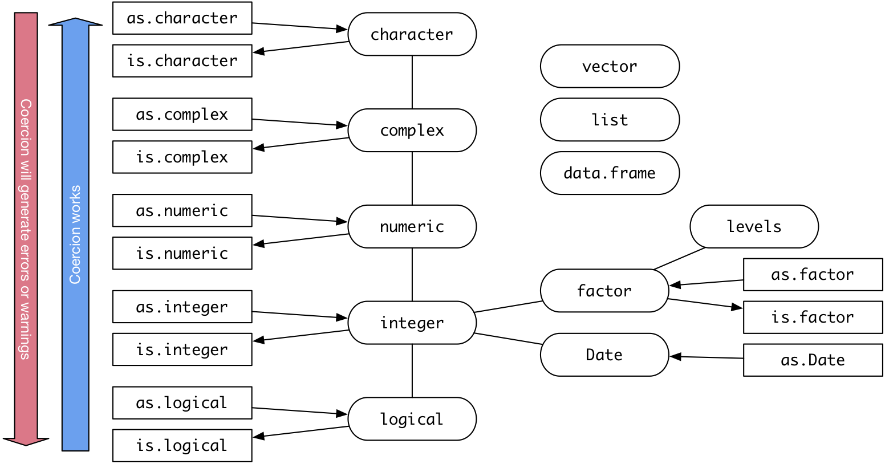
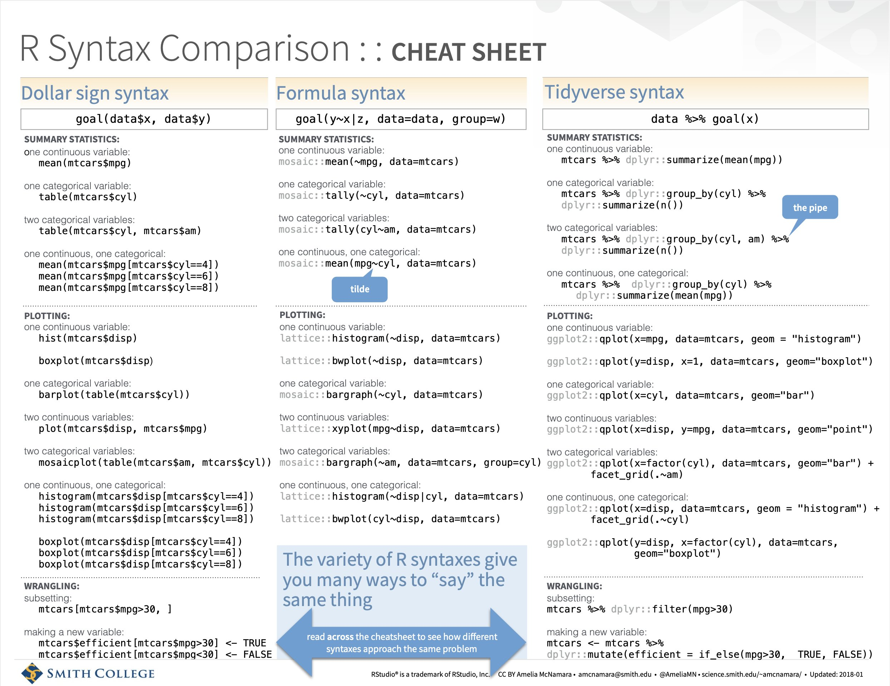

```{r setup, include = FALSE}
# Cartoons from https://github.com/allisonhorst/stats-illustrations
# dplyr based upon https://allisonhorst.shinyapps.io/dplyr-learnr/#section-welcome

source('../config.R', local = TRUE)
```

class: center, middle, inverse, title-slide

# `r metadata$title`
## `r metadata$subtitle`
### `r metadata$author`
### `r metadata$date`


---
# One Minute Paper Results

```{r, echo=FALSE, eval = TRUE}
library(googlesheets4)
library(tidyverse)
 omp <- read_sheet(one_minute_paper_results)
# names(omp)[8] <- 'Time_Spent'
# omp$Time_Spent <- NULL
# omp$Time_Spent <- sapply(omp$Time_Spent, FUN = function(x) { x[[1]] })
 omp <- omp %>% dplyr::filter(Topic == 'Intro to Data (Chapter 1)')
```

.pull-left[
**What was the most important thing you learned during this class?**
```{r, echo=FALSE, cache = TRUE, fig.height=9, eval = TRUE}
 ompWordCloud(omp$`What was the most important thing you learned during this class?`)
```
]
.pull-right[
**What important question remains unanswered for you?**
```{r, echo=FALSE, cache = TRUE, fig.height=9, eval = TRUE}
 ompWordCloud(omp$`What important question remains unanswered for you?`)
```
]


---
# Workflow

.center[

]

.font80[Source: [Wickham & Grolemund, 2017](https://r4ds.had.co.nz)]


---
# Tidy Data

.center[

]

See Wickham (2014) [Tidy data](https://vita.had.co.nz/papers/tidy-data.html).


---
# Types of Data

.pull-left[
* Numerical (quantitative)
	* Continuous
	* Discrete
]
.pull-right[
* Categorical (qualitative)
	* Regular categorical
	* Ordinal
]
.center[

]

---
# Data Types in R

```{r, echo=FALSE, fig.align='center', out.width=1000}

```


---
# Data Types / Descriptives / Visualizations


Data Type    |  Descriptive Stats                            | Visualization
-------------|-----------------------------------------------|-------------------|
Continuous   | mean, median, mode, standard deviation, IQR   | histogram, density, box plot
Discrete     | contingency table, proportional table, median | bar plot
Categorical  | contingency table, proportional table         | bar plot
Ordinal      | contingency table, proportional table, median | bar plot
Two quantitative | correlation                               | scatter plot
Two qualitative  | contingency table, chi-squared            | mosaic plot, bar plot
Quantitative & Qualitative | grouped summaries, ANOVA, t-test | box plot

---
# Statistics

.pull-left[
When describing a quantitative variable we are often interested in two things:

1. A measure of center
2. A measure of spread

The most common measures we will use in this class is the mean and median.

$$ \bar{x} = \frac{\Sigma(x_i)}{n} $$

$$ S^2 = \frac{\Sigma (x_i - \bar{x})^2}{N}$$

]
.pull-right[

Note that in the numerator for the variance calculation we square the differences (also known as deviations). Squaring terms is common practice in statistics that serves two purposes:

1. It makes all the values positive.

2. It weighs observations that are further from the center more.

]


---
# Variance

.pull-left[
Population Variance:
$$ S^2 = \frac{\Sigma (x_i - \bar{x})^2}{N}$$
Consider a dataset with five values (black points in the figure). For the largest value, the deviance is represented by the blue line ( $x_i - \bar{x}$ ).

See also:
https://shiny.rit.albany.edu/stat/visualizess/  
https://github.com/jbryer/VisualStats/

]
.pull-right[

```{r, echo=FALSE, fig.height=12}
x <- c(97.88, 107.91, 88.26, 115.21, 87.38)
variance_vis(x,
			 plot_mean = TRUE,
			 plot_deviances = FALSE,
			 plot_deviances_x = which(x == max(x)),
			 plot_deviances_y = FALSE,
			 plot_sample_variance = FALSE,
			 plot_population_variance = FALSE,
			 plot_population_sd = FALSE)
```
]

---
# Variance (cont.)

.pull-left[
Population Variance:
$$ S^2 = \frac{\Sigma (x_i - \bar{x})^2}{N}$$
In the numerator, we square each of these deviances. We can conceptualize this as a square. Here, we add the deviance in the *y* direction.
]
.pull-right[
```{r, echo=FALSE, fig.height=12}
variance_vis(x,
			 plot_mean = TRUE,
			 plot_deviances = FALSE,
			 plot_deviances_x = which(x == max(x)),
			 plot_deviances_y = which(x == max(x)),
			 plot_sample_variance = FALSE,
			 plot_population_variance = FALSE,
			 plot_population_sd = FALSE)
```
]

---
# Variance (cont.)

.pull-left[
Population Variance:
$$ S^2 = \frac{\Sigma (x_i - \bar{x})^2}{N}$$

We end up with a square.
]
.pull-right[
```{r, echo=FALSE, fig.height=12}
variance_vis(x,
			 plot_mean = TRUE,
			 plot_deviances = which(x == max(x)),
			 plot_deviances_x = which(x == max(x)),
			 plot_deviances_y = which(x == max(x)),
			 plot_sample_variance = FALSE,
			 plot_population_variance = FALSE,
			 plot_population_sd = FALSE)
```
]

---
# Variance (cont.)

.pull-left[
Population Variance:
$$ S^2 = \frac{\Sigma (x_i - \bar{x})^2}{N}$$
We can plot the squared deviance for all the data points. That is, each component in the numerator is the area of each of these squares.
]
.pull-right[
```{r, echo=FALSE, fig.height=12}
variance_vis(x,
			 plot_mean = TRUE,
			 plot_deviances = TRUE,
			 plot_deviances_x = FALSE,
			 plot_deviances_y = FALSE,
			 plot_sample_variance = FALSE,
			 plot_population_variance = FALSE,
			 plot_population_sd = FALSE)
```
]

---
# Variance (cont.)

.pull-left[
Population Variance:
$$ S^2 = \frac{\Sigma (x_i - \bar{x})^2}{N}$$
The variance is therefore the average of the area of all these squares, here represented by the orange square.
]
.pull-right[

```{r, echo=FALSE, fig.height=12}
variance_vis(x,
			 plot_mean = TRUE,
			 plot_deviances = TRUE,
			 plot_deviances_x = FALSE,
			 plot_deviances_y = FALSE,
			 plot_sample_variance = FALSE,
			 plot_population_variance = TRUE,
			 plot_population_sd = FALSE)
```
]

---
# Population versus Sample Variance

.pull-left[
Typically we want the sample variance. The difference is we divide by $n - 1$ to calculate the sample variance. This results in a slightly larger area (variance) then if we divide by $n$.

Population Variance (yellow):
$$ S^2 = \frac{\Sigma (x_i - \bar{x})^2}{N}$$

Sample Variance (green):
$$ s^2 = \frac{\Sigma (x_i - \bar{x})^2}{n-1}$$

]
.pull-right[

```{r, echo=FALSE, fig.height=12}
variance_vis(x,
			 plot_mean = TRUE,
			 plot_deviances = TRUE,
			 plot_deviances_x = FALSE,
			 plot_deviances_y = FALSE,
			 plot_sample_variance = TRUE,
			 plot_population_variance = TRUE,
			 plot_population_sd = FALSE)
```

]

---
# Robust Statistics

Consider the following data randomly selected from the normal distribution:

.pull-left[
```{r, echo=TRUE, fig.height=2}
set.seed(41)
x <- rnorm(30, mean = 100, sd = 15)
mean(x); sd(x)
median(x); IQR(x)
```
]
.pull-right[
```{r, echo=FALSE}
ggplot(data.frame(x = x, y = 0), aes(x = x)) + geom_histogram(bins = 6)
```
]

---
# Robust Statistics

```{r, echo=FALSE, fig.height=2.5}
ggplot() + 
	geom_point(data = data.frame(x = x, y = 0), aes(x = x, y = y), size = 3, alpha = 0.5) +
	geom_segment(aes(y = 0.1, yend = 0.1, x = mean(x) - sd(x), xend = mean(x) + sd(x)), color = 'blue') +
	geom_segment(aes(y = 0.2, yend = 0.2, x = median(x) - IQR(x), xend = median(x) + IQR(x)), color = 'maroon') +
	geom_vline(xintercept = mean(x), linetype = 2, color = 'blue') +
	geom_vline(xintercept = median(x), linetype = 3, color = 'maroon', size = 1.5) +
	geom_text(aes(label = paste0('mean = ', round(mean(x), digits = 2)), x = mean(x) + sd(x), y = 0.1), vjust = -1, color = 'blue') +
	geom_text(aes(label = paste0('median = ', round(median(x), digits = 2)), x = median(x) + sd(x), y = 0.2), vjust = -1, color = 'maroon') +
	geom_text(aes(label = paste0('SD = ', round(sd(x), digits = 2)), x = mean(x) + sd(x), y = 0.1), vjust = 1.5, color = 'blue') +
	geom_text(aes(label = paste0('IQR = ', round(IQR(x), digits = 2)), x = median(x) + sd(x), y = 0.2), vjust = 1.5, color = 'maroon') +
	theme(axis.line.y = element_blank(), axis.text.y = element_blank(),
		  axis.ticks.y = element_blank()) + ylab('') +
	ylim(0, .3) 
```

---
# Robust Statistics

```{r, echo=FALSE, fig.height=2.5}
ggplot() + 
	geom_point(data = data.frame(x = x, y = 0), aes(x = x, y = y), size = 3, alpha = 0.5) +
	geom_segment(aes(y = 0.1, yend = 0.1, x = mean(x) - sd(x), xend = mean(x) + sd(x)), color = 'blue') +
	geom_segment(aes(y = 0.2, yend = 0.2, x = median(x) - IQR(x), xend = median(x) + IQR(x)), color = 'maroon') +
	geom_vline(xintercept = mean(x), linetype = 2, color = 'blue') +
	geom_vline(xintercept = median(x), linetype = 3, color = 'maroon', size = 1.5) +
	geom_text(aes(label = paste0('mean = ', round(mean(x), digits = 2)), x = mean(x) + sd(x), y = 0.1), vjust = -1, color = 'blue') +
	geom_text(aes(label = paste0('median = ', round(median(x), digits = 2)), x = median(x) + sd(x), y = 0.2), vjust = -1, color = 'maroon') +
	geom_text(aes(label = paste0('SD = ', round(sd(x), digits = 2)), x = mean(x) + sd(x), y = 0.1), vjust = 1.5, color = 'blue') +
	geom_text(aes(label = paste0('IQR = ', round(IQR(x), digits = 2)), x = median(x) + sd(x), y = 0.2), vjust = 1.5, color = 'maroon') +
	theme(axis.line.y = element_blank(), axis.text.y = element_blank(),
		  axis.ticks.y = element_blank()) + ylab('') +
	ylim(0, .3) + xlim(-30, 1000)
```

Let's add an extreme value:

```{r}
x <- c(x, 1000)
```

--

```{r, echo=FALSE, fig.height=2.5}
ggplot() + 
	geom_point(data = data.frame(x = x, y = 0), aes(x = x, y = y), size = 3, alpha = 0.5) +
	geom_segment(aes(y = 0.1, yend = 0.1, x = mean(x) - sd(x), xend = mean(x) + sd(x)), color = 'blue') +
	geom_segment(aes(y = 0.2, yend = 0.2, x = median(x) - IQR(x), xend = median(x) + IQR(x)), color = 'maroon') +
	geom_vline(xintercept = mean(x), linetype = 2, color = 'blue') +
	geom_vline(xintercept = median(x), linetype = 3, color = 'maroon', size = 1.5) +
	geom_text(aes(label = paste0('mean = ', round(mean(x), digits = 2)), x = mean(x) + sd(x), y = 0.1), vjust = -1, color = 'blue') +
	geom_text(aes(label = paste0('median = ', round(median(x), digits = 2)), x = median(x) + sd(x), y = 0.2), vjust = -1, color = 'maroon') +
	geom_text(aes(label = paste0('SD = ', round(sd(x), digits = 2)), x = mean(x) + sd(x), y = 0.1), vjust = 1.5, color = 'blue') +
	geom_text(aes(label = paste0('IQR = ', round(IQR(x), digits = 2)), x = median(x) + sd(x), y = 0.2), vjust = 1.5, color = 'maroon') +
	theme(axis.line.y = element_blank(), axis.text.y = element_blank(),
		  axis.ticks.y = element_blank()) + ylab('') +
	ylim(0, .3) + xlim(-30, 1000)
```

---
# Robust Statistics

Median and IQR are more robust to skewness and outliers than mean and SD. Therefore,

* for skewed distributions it is often more helpful to use median and IQR to describe the center and spread

* for symmetric distributions it is often more helpful to use the mean and SD to describe the center and spread


---
class: font80
# About `legosets` `r hexes(c('brickset'))`

To install the `brickset` package:

```{r, eval=FALSE}
remotes::install_github('jbryer/brickset')
```

To load the load the `legosets` dataset.

```{r}
data('legosets', package = 'brickset')
```

The `legosets` data has `r nrow(legosets)` observations of `r ncol(legosets)` variables.

.code70[
```{r}
names(legosets)
```
]

---
# Structure (`str`) `r hexes(c('brickset'))`

.code50[

```{r}
str(legosets)
```

]

---
# RStudio Eenvironment tab can help `r hexes(c('rstudio'))`

```{r, echo=FALSE, out.width=500}

```

---
class: hide-logo
# Table View 

.font60[

```{r eval=require('DT'), echo=FALSE, tidy=FALSE}
legosets %>%
	sample_n(100) %>% 
	select(setID, name, year, theme, themeGroup, category, US_retailPrice, pieces, minifigs, rating) %>%
	DT::datatable(fillContainer = FALSE, options = list(pageLength = 10))
```

]


---
# Data Wrangling Cheat Sheet `r hexes(c('dplyr'))`

.center[
<a href='https://github.com/rstudio/cheatsheets/raw/master/data-transformation.pdf' target='_new'></a>
]


---
# Tidyverse vs Base R `r hexes(c('tidyverse', 'pipe'))`

.center[
<a href='images/R_Syntax_Comparison.jpeg' target='_new'></a>
]


---
class: font90
# Pipes `%>%` and `|>` `r hexes(c('magrittr'))`


.font90[
The pipe operator (`%>%`) introduced with the `magrittr` R package allows for the chaining of R operations. As of version 4.1, R now has a native pipe operator (`|>`). They take the output from the left-hand side and passes it as the first parameter to the function on the right-hand side.
]

.pull-left[
You can do this in two steps:

```{r, eval=FALSE}
tab_out <- table(legosets$category)
prop.table(tab_out)
```

Or as nested function calls.

```{r, eval=FALSE}
prop.table(table(legosets$category))
```
]
.pull-right[
Using the pipe (`|>`) operator we can chain these calls in a what is arguably a more readable format:

```{r, eval=FALSE}
table(legosets$category) |> prop.table()
```
]

<hr />

```{r, echo=FALSE}
table(legosets$category) |> prop.table()
```

---
# Filter `r hexes(c('dplyr','tidyverse'))`

.center[

]

---
# Logical Operators

* `!a` - TRUE if a is FALSE
* `a == b` - TRUE if a and be are equal
* `a != b` - TRUE if a and b are not equal
* `a > b` - TRUE if a is larger than b, but not equal
* `a >= b` - TRUE if a is larger or equal to b
* `a < b` - TRUE if a is smaller than be, but not equal
* `a <= b` - TRUE if a is smaller or equal to b
* `a %in% b` - TRUE if a is in b where b is a vector  
```{r}
which( letters %in% c('a','e','i','o','u') )
```
* `a | b` - TRUE if a *or* b are TRUE
* `a & b` - TRUE if a *and* b are TRUE
* `isTRUE(a)` - TRUE if a is TRUE

---
# Filter `r hexes(c('dplyr','tidyverse'))`

### `dplyr`

```{r}
mylego <- legosets %>% filter(themeGroup == 'Educational' & year > 2015)
```

### Base R

```{r, eval=FALSE}
mylego <- legosets[legosets$themeGroup == 'Educational' & legosets$year > 2015,]
```

<hr />

```{r}
nrow(mylego)
```

---
# Select `r hexes(c('dplyr','tidyverse'))`

### `dplyr`

```{r}
mylego <- mylego %>% select(setID, pieces, theme, availability, US_retailPrice, minifigs)
```

### Base R

```{r, eval=FALSE}
mylego <- mylego[,c('setID', 'pieces', 'theme', 'availability', 'US_retailPrice', 'minifigs')]
```

<hr />

```{r}
head(mylego, n = 4)
```

---
# Relocate `r hexes(c('dplyr','tidyverse'))`

.center[

]

---
# Relocate `r hexes(c('dplyr','tidyverse'))`

### `dplyr`

```{r}
mylego %>% relocate(where(is.numeric), .after = where(is.character)) %>% head(n = 3)
```

### Base R

```{r}
mylego2 <- mylego[,c('theme', 'availability', 'setID', 'pieces', 'US_retailPrice', 'minifigs')]
head(mylego2, n = 3)
```


---
# Rename `r hexes(c('dplyr','tidyverse'))`

.center[

]

---
# Rename `r hexes(c('dplyr','tidyverse'))`

### `dplyr`

```{r}
mylego %>% dplyr::rename(USD = US_retailPrice) %>% head(n = 3)
```

### Base R

```{r}
names(mylego2)[5] <- 'USD'
head(mylego2, n = 3)
```

---
# Mutate `r hexes(c('dplyr','tidyverse'))`

.center[

]

---
# Mutate `r hexes(c('dplyr','tidyverse'))`

### `dplyr`

```{r}
mylego %>% filter(!is.na(pieces) & !is.na(US_retailPrice)) %>% 
	mutate(Price_per_piece = US_retailPrice / pieces) %>% head(n = 3)
```

### Base R

```{r}
mylego2 <- mylego[!is.na(mylego$US_retailPrice) & !is.na(mylego$Price_per_piece),]
mylego2$Price_per_piece <- mylego2$Price_per_piece / mylego2$US_retailPrice
head(mylego2, n = 3)
```


---
# Group By and Summarize `r hexes(c('dplyr','tidyverse'))`

.code80[
```{r}
legosets %>% group_by(themeGroup) %>% summarize(mean_price = mean(US_retailPrice, na.rm = TRUE),
												sd_price = sd(US_retailPrice, na.rm = TRUE),
												median_price = median(US_retailPrice, na.rm = TRUE),
												n = n(),
												missing = sum(is.na(US_retailPrice)))
```
]

---
# Describe and Describe By

```{r}
library(psych)
describe(legosets$US_retailPrice)
```

```{r, echo=FALSE, results='hide'}
options(width = 120)
```

```{r}
describeBy(legosets$US_retailPrice, group = legosets$availability, mat = TRUE, skew = FALSE)
```


---
# Additional Resources

For data wrangling:

* `dplyr` website: https://dplyr.tidyverse.org
* R for Data Science book: https://r4ds.had.co.nz/wrangle-intro.html
* Wrangling penguins tutorial: https://allisonhorst.shinyapps.io/dplyr-learnr/#section-welcome
* Data transformation cheat sheet: https://github.com/rstudio/cheatsheets/raw/master/data-transformation.pdf


---
class: left, font140
# One Minute Paper

.pull-left[
1. What was the most important thing you learned during this class?
2. What important question remains unanswered for you?
]
.pull-right[
```{r, echo=FALSE, fig.width=5, fig.height=5}
qrcode::qr_code(one_minute_paper) |> plot(col = c('#FAFAFA', 'black'))
```
]

`r one_minute_paper`
