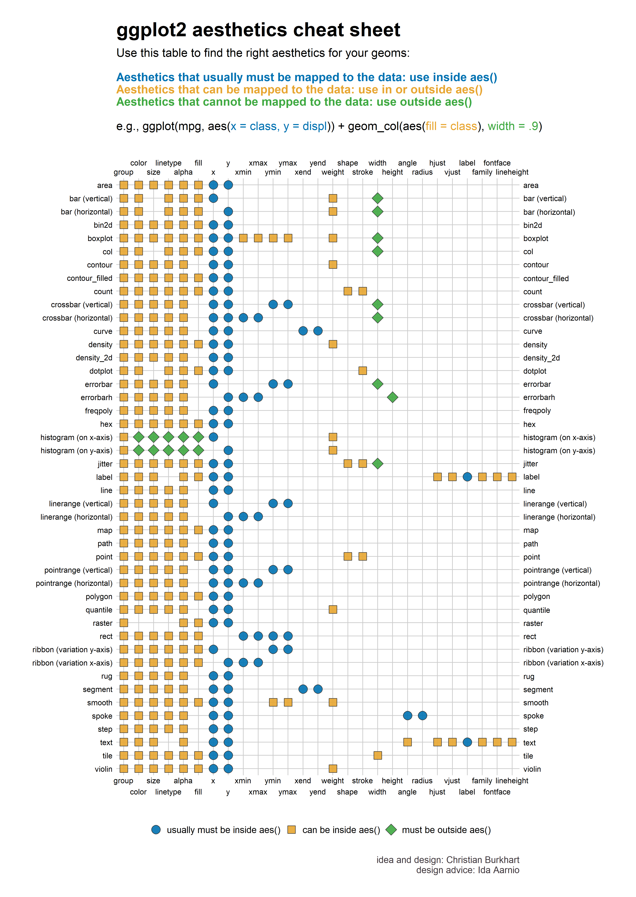

```{r setup, include = FALSE}
# Cartoons from https://github.com/allisonhorst/stats-illustrations
# dplyr based upon https://allisonhorst.shinyapps.io/dplyr-learnr/#section-welcome

source('../config.R')
data('legosets', package = 'brickset')

```

class: center, middle, inverse, title-slide

# `r metadata$title`
## `r metadata$subtitle`
### `r metadata$author`
### `r metadata$date`


---
# One Minute Paper Results

```{r, echo=FALSE, eval = TRUE}
library(googlesheets4)
library(tidyverse)
omp <- read_sheet(one_minute_paper_results)
# names(omp)[8] <- 'Time_Spent'
# omp$Time_Spent <- NULL
# omp$Time_Spent <- sapply(omp$Time_Spent, FUN = function(x) { x[[1]] })
omp <- omp %>% dplyr::filter(Topic == 'Intro to Data (Chapter 1)')
```

.pull-left[
**What was the most important thing you learned during this class?**
```{r, echo=FALSE, cache = TRUE, fig.height=9, eval = TRUE}
ompWordCloud(omp$`What was the most important thing you learned during this class?`)
```
]
.pull-right[
**What important question remains unanswered for you?**
```{r, echo=FALSE, cache = TRUE, fig.height=9, eval = TRUE}
ompWordCloud(omp$`What important question remains unanswered for you?`)
```
]


---
class: middle
# Grammer of Graphics

.center[

]

---
# Data Visualizations with ggplot2 `r hexes(c('ggplot2'))`

* `ggplot2` is an R package that provides an alternative framework based upon Wilkinson’s (2005) Grammar of Graphics.

* `ggplot2` is, in general, more flexible for creating "prettier" and complex plots.

* Works by creating layers of different types of objects/geometries (i.e. bars, points, lines, polygons, etc.)
`ggplot2` has at least three ways of creating plots:
     1. `qplot`
     2. `ggplot(...) + geom_XXX(...) + ...`
     3. `ggplot(...) + layer(...)`

* We will focus only on the second.


---
# Parts of a `ggplot2` Statement `r hexes(c('ggplot2'))`

* Data  
`ggplot(myDataFrame, aes(x=x, y=y))`

* Layers  
`geom_point()`, `geom_histogram()`

* Facets  
`facet_wrap(~ cut)`, `facet_grid(~ cut)`

* Scales  
`scale_y_log10()`

* Other options  
`ggtitle('my title')`, `ylim(c(0, 10000))`, `xlab('x-axis label')`

---
# Lots of geoms `r hexes(c('ggplot2'))`

```{r}
ls('package:ggplot2')[grep('^geom_', ls('package:ggplot2'))]
```

---
# Data Visualization Cheat Sheet `r hexes(c('ggplot2'))`

.center[
<a href='https://github.com/rstudio/cheatsheets/raw/master/data-visualization-2.1.pdf'></a>
]


---
# Scatterplot  `r hexes(c('ggplot2'))`

```{r, warning=FALSE}
ggplot(legosets, aes(x=pieces, y=US_retailPrice)) + geom_point()
```

---
# Scatterplot (cont.)  `r hexes(c('ggplot2'))`

```{r, warning=FALSE}
ggplot(legosets, aes(x=pieces, y=US_retailPrice, color=availability)) + geom_point()
```

---
# Scatterplot (cont.)  `r hexes(c('ggplot2'))`

```{r, warning=FALSE}
ggplot(legosets, aes(x=pieces, y=US_retailPrice, size=minifigs, color=availability)) + geom_point()
```

---
# Scatterplot (cont.)  `r hexes(c('ggplot2'))`

```{r, warning=FALSE}
ggplot(legosets, aes(x=pieces, y=US_retailPrice, size=minifigs)) + geom_point() + facet_wrap(~ availability)
```

---
# Boxplots  `r hexes(c('ggplot2'))`

```{r, warning=FALSE}
ggplot(legosets, aes(x='Lego', y=US_retailPrice)) + geom_boxplot()
```

---
# Boxplots (cont.)  `r hexes(c('ggplot2'))`

```{r, warning=FALSE}
ggplot(legosets, aes(x=availability, y=US_retailPrice)) + geom_boxplot()
```

---
# Boxplot (cont.)  `r hexes(c('ggplot2'))`

```{r, warning=FALSE}
ggplot(legosets, aes(x=availability, y=US_retailPrice)) + geom_boxplot() + coord_flip()
```

---
# Histograms `r hexes(c('ggplot2'))`

```{r}
ggplot(legosets, aes(x = US_retailPrice)) + geom_histogram(binwidth = 25)
```

---
# Histograms (cont.)`r hexes(c('ggplot2'))`

```{r}
ggplot(legosets, aes(x = US_retailPrice)) + geom_histogram(bins = 15) + scale_x_log10()
```

---
# Histograms (cont.) `r hexes(c('ggplot2'))`

```{r}
ggplot(legosets, aes(x = US_retailPrice)) + geom_histogram(binwidth = 25) + facet_wrap(~ availability)
```

---
# Density Plots `r hexes(c('ggplot2'))`

```{r}
ggplot(legosets, aes(x = US_retailPrice, color = availability)) + geom_density()
```

---
# Density Plots (cont.) `r hexes(c('ggplot2'))`

```{r}
ggplot(legosets, aes(x = US_retailPrice, color = availability)) + geom_density() + scale_x_log10()
```

---
# `ggplot2` aesthetics `r hexes(c('ggplot2'))`

.center[
<a href='images/ggplot_aesthetics_cheatsheet.png' target='_new'> </a>
]

---
# Likert Scales `r hexes(c('likert'))`

Likert scales are a type of questionnaire where respondents are asked to rate items on scales usually ranging from four to seven levels (e.g. strongly disagree to strongly agree).

```{r, message=FALSE, warning=FALSE}
library(likert)
library(reshape)
data(pisaitems)
items24 <- pisaitems[,substr(names(pisaitems), 1,5) == 'ST24Q']
items24 <- rename(items24, c(
			ST24Q01="I read only if I have to.",
			ST24Q02="Reading is one of my favorite hobbies.",
			ST24Q03="I like talking about books with other people.",
			ST24Q04="I find it hard to finish books.",
			ST24Q05="I feel happy if I receive a book as a present.",
			ST24Q06="For me, reading is a waste of time.",
			ST24Q07="I enjoy going to a bookstore or a library.",
			ST24Q08="I read only to get information that I need.",
			ST24Q09="I cannot sit still and read for more than a few minutes.",
			ST24Q10="I like to express my opinions about books I have read.",
			ST24Q11="I like to exchange books with my friends."))

```

---
# `likert` R Package `r hexes(c('likert'))`

```{r}
l24 <- likert(items24)
summary(l24)
```

---
# `likert` Plots  `r hexes(c('likert'))`

```{r, fig.width=8}
plot(l24)
```


---
# Pie Charts

There is only one pie chart in *OpenIntro Statistics* (Diez, Barr, & Çetinkaya-Rundel, 2015, p. 48). Consider the following three pie charts that represent the preference of five different colors. Is there a difference between the three pie charts? This is probably a difficult to answer.

<center></center>


---
# Pie Charts

There is only one pie chart in *OpenIntro Statistics* (Diez, Barr, & Çetinkaya-Rundel, 2015, p. 48). Consider the following three pie charts that represent the preference of five different colors. Is there a difference between the three pie charts? This is probably a difficult to answer.

<center></center>

<center></center>

Source: [https://en.wikipedia.org/wiki/Pie_chart](https://en.wikipedia.org/wiki/Pie_chart).

---
class: middle
# Just say NO to pie charts!

.font150[
"There is no data that can be displayed in a pie chart that cannot better be displayed in some other type of chart"]
.right[.font130[John Tukey]]

---
# Additional Resources

For data wrangling:

* `dplyr` website: https://dplyr.tidyverse.org
* R for Data Science book: https://r4ds.had.co.nz/wrangle-intro.html
* Wrangling penguins tutorial: https://allisonhorst.shinyapps.io/dplyr-learnr/#section-welcome
* Data transformation cheat sheet: https://github.com/rstudio/cheatsheets/raw/master/data-transformation.pdf

For data visualization:

* `ggplot2` website: https://ggplot2.tidyverse.org
* R for Data Science book: https://r4ds.had.co.nz/data-visualisation.html
* R Graphics Cookbook: https://r-graphics.org
* Data visualization cheat sheet: https://github.com/rstudio/cheatsheets/raw/master/data-visualization-2.1.pdf

---
class: left, font140
# One Minute Paper

.pull-left[
1. What was the most important thing you learned during this class?
2. What important question remains unanswered for you?
]
.pull-right[
```{r, echo=FALSE, fig.width=5, fig.height=5}
qrcode::qr_code(one_minute_paper) |> plot(col = c('#FAFAFA', 'black'))
```
]

`r one_minute_paper`
