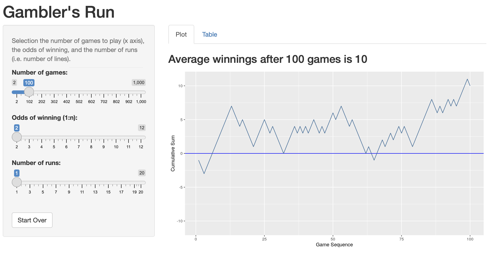
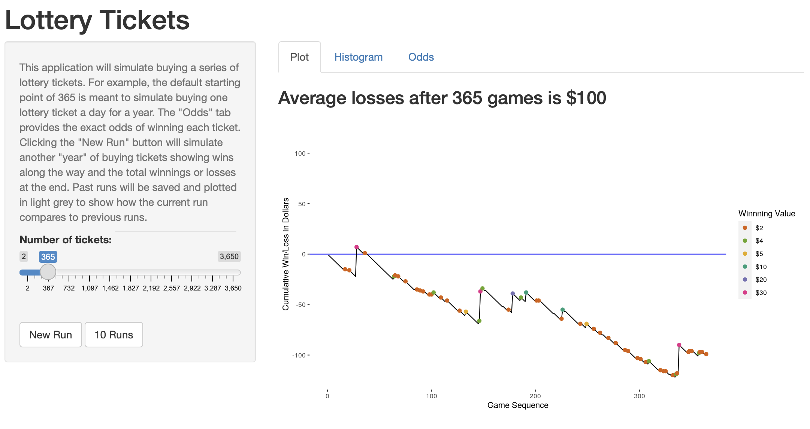

```{r setup, include = FALSE}
# Cartoons from https://github.com/allisonhorst/stats-illustrations
# dplyr based upon https://allisonhorst.shinyapps.io/dplyr-learnr/#section-welcome

source('../config.R')
```

class: center, middle, inverse, title-slide

# `r metadata$title`
## `r metadata$subtitle`
### `r metadata$author`
### `r metadata$date`

---
# One Minute Paper Results

```{r, echo=FALSE}
library(googlesheets4)
omp <- read_sheet(one_minute_paper_results)
# names(omp)[8] <- 'Time_Spent'
# omp$Time_Spent <- NULL
# omp$Time_Spent <- sapply(omp$Time_Spent, FUN = function(x) { x[[1]] })
omp <- omp %>% filter(Topic == 'Summarizing Data (Chapter 2)')
```

.pull-left[
**What was the most important thing you learned during this class?**
```{r, echo=FALSE, fig.height=9}
ompWordCloud(omp$`What was the most important thing you learned during this class?`)
```
]
.pull-right[
**What important question remains unanswered for you?**
```{r, echo=FALSE, fig.height=9}
ompWordCloud(omp$`What important question remains unanswered for you?`)
```
]


---
# Probability

There are two key properties of probability models:

1. P(A) = The probability of event A
2. $0 \le P(A) \le 1$

This semester we will examine two interpretations of probabilty:

* **Frequentist interpretation**: The probability of an outcome is the proportion of times the outcome would occur if we observed the random process an infinite number of times.

* **Bayesian interpretation**: A Bayesian interprets probability as a subjective degree of belief: For the same event, two separate people could have different viewpoints and so assign different probabilities. Largely popularized by revolutionary advance in computational technology and methods during the last twenty years.

---
# Law of Large Numbers

Law of large numbers states that as more observations are collected, the proportion of occurrences with a particular outcome, ${\hat{p}}_n$, converges to the probability of that outcome, $p$.

--

When tossing a fair coin, if heads comes up on each of the first 10 tosses, what do you think the chance is that another head will come up on the next coin toss? 0.5, less 0.5, or greater 0.5?

--

When tossing a fair coin, if heads comes up on each of the first 10 tosses, what do you think the chance is that another head will come up on the next coin toss? 0.5, less 0.5, or greater 0.5?

* The probability is still 0.5, or there is still a 50% chance that another head will come up on the next toss.
* The coin is not "due"" for a tail.
* The common misunderstanding of the LLN is that random processes are supposed to compensate for whatever happened in the past; this is just not true and is also called **gambler’s fallacy** (or **law of averages**).

---
# Coin Toss Demo

```{r, eval=FALSE}
library(DATA606)
shiny_demo('gambler')
```

.center[

<a href='https://r.bryer.org/shiny/gambler/' target='_new'></a>

]

---
# Coin Tosses

```{r}
coins <- sample(c(-1,1), 1000, replace=TRUE)
plot(1:length(coins), cumsum(coins), type='l')
abline(h=0)
```

---
# Coin Tosses (Full Range) 

```{r}
plot(1:length(coins), cumsum(coins), type='l', ylim=c(-1000, 1000))
abline(h=0)
```

---
# Disjoint and non-disjoint outcomes

**Disjoint** (mutually exclusive) outcomes: Cannot happen at the same time.

* The outcome of a single coin toss cannot be a head and a tail. A student both cannot fail and pass a class.
* A single card drawn from a deck cannot be an ace and a queen.

**Non-disjoint** outcomes: Can happen at the same time.

* A student can get an A in Stats and A in Econ in the same semester.

---
# Probability Distributions

A probability distribution lists all possible events and the probabilities with which they occur.

* The probability distribution for the a coin toss:

Event      | Heads | Tails
-----------|-------|---------
Probability | 0.5   | 0.5

Rules for probability distributions: 

1. The events listed must be disjoint
2. Each probability must be between 0 and 1 
3. The probabilities must total 1

---
# Probabilty Distrubtions (cont.)

The probability distribution for two coin tosses:

Event       | HH   | TT   | HT   | TH
------------|------|------|------|------
Probability | 0.25 | 0.25 | 0.25 | 0.25

---
# Independence

Two processes are independent if knowing the outcome of one provides no useful information about the outcome of the other.

* Knowing that the coin landed on a head on the first toss does not provide any useful information for determining what the coin will land on in the second toss. → Outcomes of two tosses of a coin are independent.

* Knowing that the first card drawn from a deck is an ace does provide useful information for determining the probability of drawing an ace in the second draw. → Outcomes of two draws from a deck of cards (without replacement) are dependent.


---
# Checking for Independence

If P(A occurs, given that B is true) = P(A | B) = P(A), then A and B are independent.

* P(protects citizens) = 0.58
* P(randomly selected NC resident says gun ownership protects citizens, given that the resident is white) = P(protects citizens | White) = 0.67
* P(protects citizens | Black) = 0.28
* P(protects citizens | Hispanic) = 0.64

P(protects citizens) varies by race/ethnicity, therefore opinion on gun ownership and race ethnicity are most likely dependent.

---
# Random Variables

A random variable is a numeric quantity whose value depends on the outcome of a random event

* We use a capital letter, like X, to denote a random variable
* The values of a random variable are denoted with a lowercase letter, in this case x
* For example, P(X = x)

There are two types of random variables:

* **Discrete random variables** often take only integer values  
Example: Number of credit hours, Difference in number of credit hours this term vs last

* **Continuous random variables** take real (decimal) values  
Example: Cost of books this term, Difference in cost of books this term vs last

---
# Lottery

```{r, eval=FALSE}
library(DATA606)
shiny_demo('lottery')
```

.center[

<a href='https://r.bryer.org/shiny/lottery/' target='_new'></a>

]


---
# Expectation

* We are often interested in the average outcome of a random variable.
* We call this the expected value (mean), and it is a weighted average of the possible outcomes

$$\mu =E(X)=\sum^{k}_{i=1} x_{i}P(X=x_{i})$$

---
# Expected value of a discrete random variable

In a game of cards you win $1 if you draw a heart, $5 if you draw an ace (including the ace of hearts), $10 if you draw the king of spades and nothing for any other card you draw. Write the probability model for your winnings, and calculate your expected winning.

Event           | X  | P(X)  | X P(X)
----------------|----|-------|--------
Heart (not Ace) | 1  | 12/52 | 12/52
Ace             | 5  |  4/52 | 20/52
King of Spades  | 10 |  1/52 | 10/52
All else        | 0  | 35/52 | 0
Total           |    |       | $E(X) = \frac{42}{52} \approx 0.81$

---
# Expected value of a discrete random variable

```{r, fig.width=10, fig.height=5}
cards <- data.frame(Event = c('Heart (not ace)','Ace','King of Spades','All else'),
	X = c(1, 5, 10, 0),	pX = c(12/52, 5/52, 1/52, 32/52) )
cards$XpX <- cards$X * cards$pX
cards2 <- rep(0, 11)
cards2[cards$X + 1] <- cards$pX
names(cards2) <- 0:10
barplot(cards2, main='Probability of Winning Game')
```

---
# Estimating Expected Values with Simulations

```{r}
tickets <- as.data.frame(rbind(
	c(    '$1',    1,     15),
	c(    '$2',    2,     11),
	c(    '$4',    4,     62),
	c(    '$5',    5,    100),
	c(   '$10',   10,    143),
	c(   '$20',   20,    250),
	c(   '$30',   30,    562),
	c(   '$50',   50,   3482),
	c(  '$100',  100,   6681),
	c(  '$500',  500,  49440),
	c('$1500',  1500, 375214),
	c('$2500',  2500, 618000)
), stringsAsFactors=FALSE)
names(tickets) <- c('Winnings', 'Value', 'Odds')
tickets$Value <- as.integer(tickets$Value)
tickets$Odds <- as.integer(tickets$Odds)
```

---
# Estimating Expected Values with Simulations

.pull-left[

```{r, fig.width=8, fig.height=3}
m <- 618000 * 375214 # A multiple of all odds
odds <- sample(m, 1000, replace=TRUE)
vals <- rep(-1, length(odds))
for(i in 1:nrow(tickets)) {
	vals[odds %% tickets[i,'Odds'] == 0] <- 
		tickets[i,'Value'] - 1 
}
head(vals, n=10)
mean(vals)
```
]
.pull-right[
```{r, fig.width=6, fig.height=6}
ggplot(data.frame(Winnings=vals), aes(x=Winnings)) + 
	geom_bar(binwidth=1)
```
]


---
# Expected Value of Lottery Example

$$\mu =E(X)=\sum^{k}_{i=1} x_{i}P(X=x_{i})$$

```{r, echo=FALSE}
tickets <- as.data.frame(rbind(
	c(    '$1',    1,     15),
	c(    '$2',    2,     11),
	c(    '$4',    4,     62),
	c(    '$5',    5,    100),
	c(   '$10',   10,    143),
	c(   '$20',   20,    250),
	c(   '$30',   30,    562),
	c(   '$50',   50,   3482),
	c(  '$100',  100,   6681),
	c(  '$500',  500,  49440),
	c('$1500',  1500, 375214),
	c('$2500',  2500, 618000)
), stringsAsFactors=FALSE)
names(tickets) <- c('Winnings', 'Value', 'Odds')
tickets$Value <- as.integer(tickets$Value)
tickets$Odds <- as.integer(tickets$Odds)

tickets$xPx <- tickets$Value * (1 / tickets$Odds)
```

.pull-left[
```{r}
tickets
```
]
.pull-right[
Expected value for one ticket
```{r}
sum(tickets$xPx) - 1 
```
]

---
# Expected Value of Lottery Example (cont)

```{r}
sum(tickets$xPx) - 1 # Expected value for one ticket
```

Simulated

```{r}
nGames <- 1
runs <- numeric(10000)
for(j in seq_along(runs)) {
	odds <- sample(max(tickets$Odds), nGames, replace = TRUE)
	vals <- rep(-1, length(odds))
	for(i in 1:nrow(tickets)) {
		vals[odds %% tickets[i,'Odds'] == 0] <- tickets[i,'Value'] - 1
	}
	runs[j] <- cumsum(vals)[nGames]
}
mean(runs)
```

---
# Note on Randomization in R

We will use many different functions throughout the course to randomly generate data. The first is the `sample` function. This function simply randomly samples from the first parameter. Consider the `letters` vector containing the 26 letters of the alphabet. Calling `sample` with just that vector will shuffle the vector.

```{r}
letters
sample(letters)
```

---
#  Note on Randomization in R  (cont.)

You can specify how many you want to return with the `size` parameter.

```{r}
sample(letters, size = 1)
```

The `replace` will ensure that each randomly selected value is independent of the others.

```{r}
sample(letters, size = 30, replace = TRUE)
```

---
# Coins Example

```{r}
coin <- c('H', 'T')
sample(coin)
sample(coin, 1)
sample(coin, 100, replace = TRUE)
```

---
# Seeds

Computers are generally not good at randomizaiton. Instead, R (and really all programs) uses a [pseudo random algorithm](https://en.wikipedia.org/wiki/Pseudorandomness). These algorithms rely on a seed, or starting point for the algorithm. You can set the seed to ensure that your analysis is reproducible. For example, setting the seed below before calling `sample` will ensure we get the same answer.

```{r}
set.seed(2112); sample(100, 1)
set.seed(2112); sample(100, 1)
```

---
# Is it really random?

```{r}
df <- data.frame(x = 1:1000, y = NA_integer_)
for(i in 1:nrow(df)) {
	set.seed(i)
	df[i,]$y <- sample(100, 1)
}
```

.pull-left[
```{r}
ggplot(df, aes(x = x, y = y)) + geom_point()
```
]

.pull-right[
```{r}
cor.test(df$x, df$y)
```
]


---
class: left, font140
# One Minute Paper

.pull-left[
1. What was the most important thing you learned during this class?
2. What important question remains unanswered for you?
]
.pull-right[
```{r, echo=FALSE, fig.width=5, fig.height=5}
qrcode::qr_code(one_minute_paper) |> plot(col = c('#FAFAFA', 'black'))
```
]

`r one_minute_paper`
