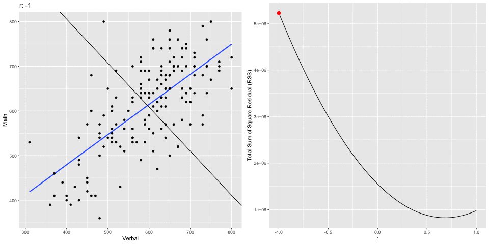

```{r setup, include = FALSE}
# Cartoons from https://github.com/allisonhorst/stats-illustrations
# dplyr based upon https://allisonhorst.shinyapps.io/dplyr-learnr/#section-welcome

source('../config.R')
options(width = 120)
```

class: center, middle, inverse, title-slide

# `r metadata$title`
## `r metadata$subtitle`
### `r metadata$author`
### `r metadata$date`

---
# One Minute Paper Results

```{r, echo=FALSE}
library(googlesheets4)
omp <- read_sheet(one_minute_paper_results)
omp <- omp %>% dplyr::filter(Topic == 'Inference for Numerical Data (Chapter 7)')
source('word_cloud.R')
```

.pull-left[
**What was the most important thing you learned during this class?**
```{r, echo=FALSE, fig.height=9}
ompWordCloud(omp$`What was the most important thing you learned during this class?`)
```
]
.pull-right[
**What important question remains unanswered for you?**
```{r, echo=FALSE, fig.height=9}
ompWordCloud(omp$`What important question remains unanswered for you?`)
```
]

---
# Announcements

**Project Presentations**  
You can sign up for a presentation slot on this [Google Sheet](https://docs.google.com/spreadsheets/d/1u5OOqJlPSYfKiGi0AjO9A7U3xkAvfisNxaX99_9XEyQ/edit?usp=sharing). Please do so ASAP.

The NYC R Group will be holding their annual conference May 16th and 17th with workshops on the 15th. As students you qualify for the academic pricing and you can get another 20% off using the code LANDER20. More info here: https://rstats.ai/nyr.html

---
# SAT Scores

We will use the SAT data for 162 students which includes their verbal and math scores. We will model math from verbal. Recall that the linear model can be expressed as:

$$y = mx + b$$

Or alternatively as:

$$y = {b}_{1}x + {b}_{0}$$

Where m (or $b_1$) is the slope and b (or $b_0$) is the intercept. Therefore, we wish to model:

$$SAT_{math} = {b}_{1}SAT_{verbal} + {b}_{0}$$

---
# Data Prep

To begin, we read in the CSV file and convert the `Verbal` and `Math` columns to integers. The data file uses `.` (i.e. a period) to denote missing values. The `as.integer` function will automatically convert those to `NA` (the indicator for a missing value in R). Finally, we use the `complete.cases` eliminate any rows with any missing values.

```{r, warning=FALSE}
sat <- read.csv('../course_data/SAT_scores.csv', stringsAsFactors=FALSE)
names(sat) <- c('Verbal','Math','Sex')
sat$Verbal <- as.integer(sat$Verbal)
sat$Math <- as.integer(sat$Math)
sat <- sat[complete.cases(sat),]
```

---
# Scatter Plot

The first step is to draw a scatter plot. We see that the relationship appears to be fairly linear.

```{r scatterplot, tidy=FALSE, echo=FALSE}
ggplot(sat, aes(x=Verbal, y=Math)) + geom_point(color='black')
```

---
# Descriptive Statistics

.pull-left[

Next, we will calculate the means and standard deviations.

```{r descriptives}
( verbalMean <- mean(sat$Verbal) )
( mathMean <- mean(sat$Math) )
```

]
.pull-right[

```{r descriptives2}
( verbalSD <- sd(sat$Verbal) )
( mathSD <- sd(sat$Math) )
( n <- nrow(sat) )
```

]

---
# Correlation

The population correlation, rho,  is defined as ${ \rho  }_{ xy }=\frac { { \sigma  }_{ xy } }{ { \sigma  }_{ x }{ \sigma  }_{ y } }$ where the numerator is the *covariance* of *x* and *y* and the denominator is the product of the two standard deviations.

--

The sample correlation is calculated as ${ r }_{ xy }=\frac { { Cov }_{ xy } }{ { s }_{ x }{ s }_{ y } }$

--

The covariates is calculated as ${ Cov }_{ xy }=\frac { \sum _{ i=1 }^{ n }{ \left( { X }_{ i }-\overline { X }  \right) \left( { Y }_{ i }-\overline { Y }  \right)  }  }{ n-1 }$

--

```{r}
(cov.xy <- sum( (sat$Verbal - verbalMean) * (sat$Math - mathMean) ) / (n - 1))
```


```{r}
cov(sat$Verbal, sat$Math)
```

---
# Correlation (cont.) 

$${ r }_{ xy }=\frac { \frac { \sum _{ i=1 }^{ n }{ \left( { X }_{ i }-\overline { X }  \right) \left( { Y }_{ i }-\overline { Y }  \right)  }  }{ n-1 }  }{ { s }_{ x }{ s }_{ y } }$$

```{r}
cov.xy / (verbalSD * mathSD)
```

```{r}
cor(sat$Verbal, sat$Math)
```

http://bcdudek.net/rectangles


---
# z-Scores

Calcualte z-scores (standard scores) for the verbal and math scores.

$$ z=\frac { y-\overline { y }  }{ s } $$

```{r zscores}
sat$Verbal.z <- (sat$Verbal - verbalMean) / verbalSD
sat$Math.z <- (sat$Math - mathMean) / mathSD
head(sat)
```

---
# Scatter Plot of z-Scores

Scatter plot of z-scores. Note that the pattern is the same but the scales on the x- and y-axes are different.

```{r scatterzscores, tidy=FALSE, echo=FALSE}
ggplot(sat, aes(x=Verbal.z, y=Math.z)) + geom_point(color='black')
```

---
# Correlation

Calculate the correlation manually using the z-score formula:

$$r=\frac { \sum { { z }_{ x }{ z }_{ y } }  }{ n-1 }$$

```{r correlation}
r <- sum( sat$Verbal.z * sat$Math.z ) / ( n - 1 )
r
```

--

.pull-left[

Or the `cor` function in R is probably simplier. 
```{r}
cor(sat$Verbal, sat$Math)
```

]

--

.pull-right[

And to show that the units don't matter, calculate the correlation with the z-scores.
```{r}
cor(sat$Verbal.z, sat$Math.z)
```

]

---
# Calculate the slope.

$$m = r\frac{S_y}{S_x} = r\frac{S_{math}}{S_{verbal}}$$

```{r slope}
m <- r * (mathSD / verbalSD)
m
```

---
# Calculate the intercept

Recall that the point where the mean of x and mean of y intersect will be on the line of best fit). Therefore,

$$b = \overline{y} - m \overline{x} = \overline{SAT_{math}} - m \overline{SAT_{verbal}}$$

```{r intercept}
b <- mathMean - m * verbalMean
b
```

---
# Scatter Plot with Regression Line

We can now add the regression line to the scatter plot. The vertical and horizontal lines represent the mean Verbal and Math SAT scores, respectively.

```{r scatterwithregressionline, tidy=FALSE, echo=FALSE}
ggplot(sat, aes(x=Verbal, y=Math)) + geom_point(color='black') +
	geom_vline(xintercept=verbalMean, color='darkmagenta') +
	geom_hline(yintercept=mathMean, color='darkmagenta') +
	geom_abline(intercept=b, slope=m, color='red', size=2, alpha=.5)
```

---
# Examine the Residuals

To examine the residuals, we first need to calculate the predicted values of y (Math scores in this example).

```{r predicted}
sat$Math.predicted <- m * sat$Verbal + b
sat$Math.predicted.z <- m * sat$Verbal.z + 0
head(sat, n=4)
```

---
# Examine the Residuals (cont.)

The residuals are simply the difference between the observed and predicted values.

```{r residuals}
sat$residual <- sat$Math - sat$Math.predicted
sat$residual.z <- sat$Math.z - sat$Math.predicted.z
head(sat, n=4)
```

---
# Scatter Plot with Residuals

Plot our regression line with lines representing the residuals. The line of best fit minimizes the residuals.

```{r scatterwithresiduals, tidy=FALSE, echo=FALSE}
ggplot(sat, aes(x=Verbal, y=Math)) + geom_point(color='black') +
	geom_abline(intercept=b, slope=m, color='red', size=2, alpha=.5) +
	geom_segment(aes(xend=Verbal, yend=Math.predicted, color=abs(residual))) +
	scale_color_gradient(low='white', high='blue')
```

---
# Scatter Plot with Residuals

Using the z-scores ensures that a 1-unit change in the *x*-axis is the same as a 1-unit change in the *y*-axis. This makes it easiert to plot the residuals as squares.

```{r scatterplotwithresidualscquares, tidy=FALSE, echo=FALSE, eval=TRUE}
ggplot(sat, aes(x = Verbal.z, y = Math.z)) +
	geom_rect(data = sat[sat$residual > 0,],
			  aes(xmin = Verbal.z - abs(residual.z),
			  	  xmax = Verbal.z,
			  	  ymin = Math.predicted.z,
			  	  ymax = Math.z,
			  	fill = abs(residual)),
			  color = 'blue', alpha = 0.1) +
	geom_rect(data = sat[sat$residual < 0,],
			  aes(xmin = Verbal.z,
			  	  xmax = Verbal.z + abs(residual.z),
			  	  ymin = Math.z,
			  	  ymax = Math.predicted.z,
			  	fill = abs(residual)),
			  color = 'aquamarine4', alpha = 0.1) +
	geom_point(color='black') +
	geom_abline(intercept = 0, slope = m, color = 'red', size = 2, alpha = .5) +
	scale_fill_gradient(low = 'white', high = 'black') +
	coord_equal()
```

---
# Minimizing Sum of Squared Residuals

## What does it mean to minimize the sum of squared residuals?

To show that $m = r \frac{S_y}{S_x}$ minimizes the sum of squared residuals, this loop will calculate the sum of squared residuals for varying values of between -1 and 1.

```{r}
results <- data.frame(r=seq(-1, 1, by=.05), 
					  m=as.numeric(NA),
					  b=as.numeric(NA),
					  sumsquares=as.numeric(NA))
for(i in 1:nrow(results)) {
	results[i,]$m <- results[i,]$r * (mathSD / verbalSD)
	results[i,]$b <-  mathMean - results[i,]$m * verbalMean
	predicted <- results[i,]$m * sat$Verbal + results[i,]$b
	residual <- sat$Math - predicted
	sumsquares <- sum(residual^2)
	results[i,]$sumsquares <- sum(residual^2)
}
```

---
# Minimizing the Sum of Squared Residuals

Plot the sum of squared residuals for different slopes (i.e. r's). The vertical line corresponds to the r (slope) calcluated above and the horizontal line corresponds the sum of squared residuals for that r. This should have the smallest sum of squared residuals.

```{r sumofsquares, tidy=FALSE, echo=FALSE}
ggplot(results, aes(x=r, y=sumsquares)) + geom_point() + 
	geom_vline(xintercept=r, color='blue') +
	geom_hline(yintercept=sum(sat$residual^2), color='magenta')
```

---
# Regression Line with RSS

```{r, echo=FALSE, cache=TRUE}

```

---
# Example of a "bad" model

To exemplify how the residuals change, the following scatter plot picks one of the "bad" models and plot that regression line with the original, best fitting line. Take particular note how the residuals would be less if they ended on the red line (i.e. the better fitting model). This is particularly evident on the far left and far right, but is true across the entire range of values.
```{r}
b.bad <- results[1,]$b
m.bad <- results[1,]$m
sat$predicted.bad <- m.bad * sat$Verbal + b.bad
```

---
# Example of a "bad" model

```{r scatterbadmodel, tidy=FALSE, echo=FALSE}
ggplot(sat, aes(x=Verbal, y=Math)) + geom_point(color='black') +
	geom_abline(intercept=b, slope=m, color='red', size=2, alpha=.2) +
	geom_abline(intercept=b.bad, slope=m.bad, color='black', size=2, alpha=.5) +
	geom_segment(aes(xend=Verbal, yend=predicted.bad), alpha=.5, color='blue')
```

---
# Residual Plot 

Next, we'll plot the residuals with the independent variable. In this plot we expect to see no pattern, bending, or clustering if the model fits well. The rug plot on the right and top given an indication of the distribution. Below, we will also examine the histogram of residuals.

```{r residualplot, tidy=FALSE, fig.height=5, echo=TRUE}
ggplot(sat, aes(x=Verbal, y=residual)) + geom_point() + geom_rug(sides='rt')
```

---
# Scatter and Residual Plot, Together 

In an attempt to show the relationship between the predicted value and the residuals, this figures combines both the basic scatter plot with the residuals. Each Math score is connected with the corresponding residual point.

```{r residualplot2, tidy=FALSE, echo=FALSE}
ggplot(sat, aes(x=Verbal, y=Math)) + geom_point(color='black', size=3) +
	geom_point(aes(x=Verbal, y=residual), color='blue', size=3) +
	geom_abline(intercept=b, slope=m, color='red', size=2, alpha=.5) +
	geom_segment(aes(xend=Verbal, yend=residual), alpha=.1) +
	geom_hline(yintercept=0) + geom_rug(aes(y=residual), color='blue', sides='rb')
```

---
# Histogram of residuals 

```{r histogramofresiduals, tidy=FALSE, echo=TRUE}
ggplot(sat, aes(x=residual)) + geom_histogram(alpha=.5, binwidth=25)
```

---
# Calculate ${R}^{2}$

```{r rsquared}
r ^ 2
```

This model accounts for `r round(r^2 * 100, digits=1)`% of the variance math score predicted from verbal score.

---
# Prediction 

Now we can predict Math scores from new Verbal.

```{r}
newX <- 550
(newY <- newX * m + b)
```
```{r predictnew, tidy=FALSE, fig.height=4.5, echo=FALSE}
ggplot(sat, aes(x=Verbal, y=Math)) + geom_point(color='black') +
	geom_abline(intercept=b, slope=m, color='red', size=2, alpha=.5) +
	geom_point(x=newX, y=newY, shape=17, color='darkgreen', size=8)
```

---
# Using R's built in function for linear modeling

.code70[

The `lm` function in R will calculate everything above for us in one command.
```{r lm}
sat.lm <- lm(Math ~ Verbal, data=sat)
summary(sat.lm)
```

]

---
# Predicted Values, Revisited

We can get the predicted values and residuals from the `lm` function

```{r lmpredictresiduals}
sat.lm.predicted <- predict(sat.lm)
sat.lm.residuals <- resid(sat.lm)
```

Confirm that they are the same as what we calculated above.

.pull-left[
```{r checking}
head(cbind(sat.lm.predicted, 
		   sat$Math.predicted), n=4)
```
]
.pull-right[
```{r}
head(cbind(sat.lm.residuals, 
		   sat$residual), n=4)
```
]

---
# Residuals - Implications for Grouping Variables

First, let's look at the scatter plot but with a sex indicator.

```{r scattersex, tidy=FALSE, echo=FALSE}
ggplot(sat, aes(x=Verbal, y=Math, color=Sex, shape=Sex)) + 
	geom_point(size=2.5) + 
	scale_color_manual(limits=c('M','F'), values=c('blue','maroon')) +
	scale_shape_manual(limits=c('M','F'), values=c(16, 17)) + coord_equal()
```

---
# Residual Plot by Sex 

And also the residual plot with an indicator for sex.

```{r residualsex, tidy=FALSE, echo=FALSE}
ggplot(sat) + 
	geom_point(aes(x=Verbal, y=residual, color=Sex, shape=Sex), size=2.5) + 
	scale_color_manual(limits=c('M','F'), values=c('blue','maroon')) +
	scale_shape_manual(limits=c('M','F'), values=c(16, 17)) + 
	geom_rug(data=subset(sat, Sex=='M'), aes(y=residual, color=Sex), sides='tr') +
	geom_rug(data=subset(sat, Sex=='F'), aes(y=residual, color=Sex), sides='lb')
```

---
# Histograms

The histograms also show that the distribution are different across sex.

```{r residualhistogramsex, tidy=FALSE, echo=FALSE}
ggplot(sat, aes(x=residual)) + geom_histogram(binwidth=25, alpha=.5) + facet_wrap(~ Sex, ncol=1)
```

---
# Grouping Variable

Upon careful examination of these two figures, there is some indication there may be a difference between sexes. In the scatter plot, it appears that there is a cluster of males towoards the top left and a cluster of females towards the right. The residual plot also shows a cluster of males on the upper left of the cluster as well as a cluster of females to the lower right. Perhaps estimating two separate models would be more appropriate.

To start, we create two data frames for each sex.

```{r}
sat.male <- sat[sat$Sex == 'M',]
sat.female <- sat[sat$Sex == 'F',]
```

---
# Descriptive Statistics

Calculate the mean for Math and Verbal for both males and females.

.code80[
```{r}
(male.verbal.mean <- mean(sat.male$Verbal))
(male.math.mean <- mean(sat.male$Math))
(female.verbal.mean <- mean(sat.female$Verbal))
(female.math.mean <- mean(sat.female$Math))
```
]

---
# Two Regression Models

Estimate two linear models for each sex.

.pull-left[

```{r}
sat.male.lm <- lm(Math ~ Verbal, 
				  data=sat.male)
sat.male.lm
```

]
.pull-right[
```{r}
sat.female.lm <- lm(Math ~ Verbal, 
					data=sat.female)
sat.female.lm
```

]

---
# Two Regression Models Visualized

We do in fact find that the intercepts and slopes are both fairly different. The figure below adds the regression lines to the scatter plot.

```{r scattersexregression, tidy=FALSE, echo=FALSE}
ggplot(sat, aes(x=Verbal, y=Math, color=Sex)) + 
	geom_point(size=2.5) +
	geom_vline(xintercept=male.verbal.mean, color='blue') +
	geom_hline(yintercept=male.math.mean, color='blue') +
	geom_vline(xintercept=female.verbal.mean, color='maroon') +
	geom_hline(yintercept=female.math.mean, color='maroon') +
	geom_abline(slope=sat.male.lm$coefficients[2], 
				intercept=sat.male.lm$coefficients[1], color='blue', size=2, alpha=.5) +
	geom_abline(slope=sat.female.lm$coefficients[2], 
				intercept=sat.female.lm$coefficients[1], color='maroon', size=2, alpha=.5) +
	geom_abline(intercept=b, slope=m, color='red', size=1, alpha=.5) +
	scale_color_manual(limits=c('M','F'), values=c('blue','maroon'))
```

---
# $R^2$

Let's compare the $R^2$ for the three models.

```{r}
cor(sat$Verbal, sat$Math) ^ 2
```

--

.pull-left[
```{r}
cor(sat.male$Verbal, sat.male$Math) ^ 2
```
]
.pull-right[
```{r}
cor(sat.female$Verbal, sat.female$Math) ^ 2
```
]

--

The $R^2$ for the full model accounts for approximately 46.9% of the variance. By estimating separate models for each sex we can account for 47.1% and 51.4% of the variance for males and females, respectively.

---
# Examining Possible Outliers

Re-examining the histogram of residuals, there is one data point with a residual higher than the rest. This is a possible outlier. In this section we'll examine how that outlier may impact our linear model.

```{r histogramoutlier, tidy=FALSE, echo=FALSE}
ggplot(sat, aes(x=residual, fill=residual > 200)) + 
	geom_histogram(alpha=.5, binwidth=25) +
	scale_fill_manual(limits=c(TRUE, FALSE), values=c('red','black'))
```

---
# Possible Outlier  

We can extract that record from our data frame. We can also highlight that point on the scatter plot.

```{r, echo=FALSE, results='hide'}
options(width=120)
```

```{r}
sat.outlier <- sat[sat$residual > 200,]
sat.outlier
```
```{r scatteroutlier, tidy=FALSE, fig.width=7, fig.height=3.5, echo=FALSE}
ggplot(sat, aes(x=Verbal, y=Math)) + 
	geom_point(size=2.5) +
	geom_point(x=sat.outlier$Verbal, y=sat.outlier$Math, color='red', size=2.5, shape=17) +
	geom_abline(intercept=b, slope=m, color='red', size=2, alpha=.5)
```

---
# Possible Outlier (cont.)

We see that excluding this point changes model slightly. With the outlier included we can account for 45.5% of the variance and by excluding it we can account for 47.9% of the variance. Although excluding this point improves our model, this is an insufficient enough reason to do so. Further explenation is necessary.

.pull-left[
```{r}
(sat.lm <- lm(Math ~ Verbal, data=sat))
```
]
.pull-right[
```{r}
(sat.lm2 <- lm(Math ~ Verbal, 
			   data=sat[sat$residual < 200,]))
```
]

---
# $R^2$ with and without the outlier

```{r}
summary(sat.lm)$r.squared
summary(sat.lm2)$r.squared
```

---
# More outliers

For the following two examples, we will add outliers to examine how they would effect our models. In the first example, we will add an outlier that is close to our fitted model (i.e. a small residual) but lies far away from the cluster of points. As we can see below, this single point increases our $R^2$ by more than 5%.
```{r}
outX <- 1200
outY <- 1150
sat.outlier <- rbind(sat[,c('Verbal','Math')], c(Verbal=outX, Math=outY))
```

---
# Regression Models

.pull-left[
```{r}
(sat.lm <- lm(Math ~ Verbal, 
			  data=sat))
```
]
.pull-right[
```{r}
(sat.lm2 <- lm(Math ~ Verbal, 
			   data=sat.outlier))
```
]

---
# Scatter Plot

```{r scatteroutlier1, tidy=FALSE, echo=FALSE}
ggplot(sat.outlier, aes(x=Verbal, y=Math)) + 
	geom_point(size=2.5) +
	geom_point(x=outX, y=outY, color='red', size=2.5, shape=17) +
	geom_abline(intercept=b, slope=m, color='red', size=2, alpha=.5) +
	geom_abline(intercept=sat.lm2$coefficients[1], slope=sat.lm2$coefficients[2], 
				size=2, alpha=.5)
```


---
# $R^2$

```{r}
summary(sat.lm)$r.squared
summary(sat.lm2)$r.squared
```


---
# Outliers

Outliers can have the opposite effect too. In this example, our $R^2$ is decreased by almost 16%.
```{r}
outX <- 300
outY <- 1150
sat.outlier <- rbind(sat[,c('Verbal','Math')], c(Verbal=outX, Math=outY))
```

.pull-left[
```{r}
(sat.lm <- lm(Math ~ Verbal, 
			  data=sat))
```
]
.pull-right[
```{r}
(sat.lm2 <- lm(Math ~ Verbal, 
			   data=sat.outlier))
```
]

---


```{r scatteroutlier1=2, tidy=FALSE, echo=FALSE}
ggplot(sat.outlier, aes(x=Verbal, y=Math)) + 
	geom_point(size=2.5) +
	geom_point(x=outX, y=outY, color='red', size=2.5, shape=17) +
	geom_abline(intercept=b, slope=m, color='red', size=2, alpha=.5) +
	geom_abline(intercept=sat.lm2$coefficients[1], slope=sat.lm2$coefficients[2], 
				size=2, alpha=.5)
```

---
# $R^2$

```{r}
summary(sat.lm)$r.squared
summary(sat.lm2)$r.squared
```


---
class: left, font140
# One Minute Paper

.pull-left[
1. What was the most important thing you learned during this class?
2. What important question remains unanswered for you?
]
.pull-right[
```{r, echo=FALSE, fig.width=5, fig.height=5}
qrcode::qr_code(one_minute_paper) |> plot(col = c('#FAFAFA', 'black'))
```
]

`r one_minute_paper`
