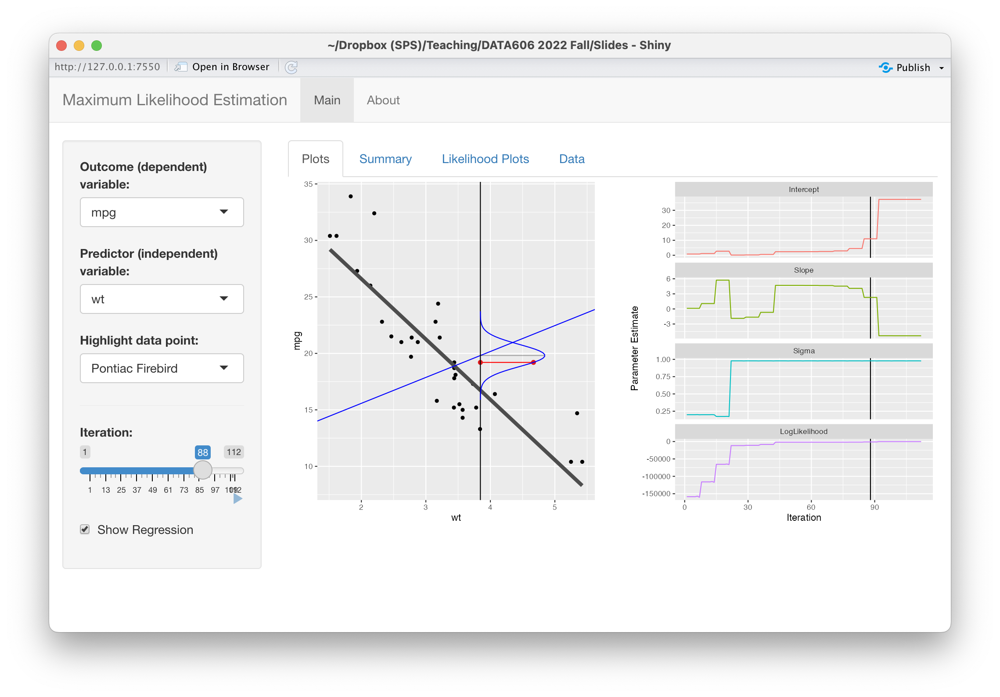

```{r setup, include = FALSE}
# Cartoons from https://github.com/allisonhorst/stats-illustrations
# dplyr based upon https://allisonhorst.shinyapps.io/dplyr-learnr/#section-welcome

source('../config.R')

library(gganimate)
library(magick)
library(cowplot)
library(DT)
source('../R/roc.R')
# library(titanic)
# data("titanic")
library(VisualStats)
# library(VisualMLE)
```

class: center, middle, inverse, title-slide

# `r metadata$title`
## `r metadata$subtitle`
### `r metadata$author`
### `r metadata$date`

---

# One Minute Paper Results

```{r, echo=FALSE, eval = TRUE}
library(googlesheets4)
omp <- read_sheet(one_minute_paper_results)
omp <- omp %>% dplyr::filter(Topic == 'Linear Regression (Chapter 8)')
source('word_cloud.R')
```

.pull-left[
**What was the most important thing you learned during this class?**
```{r, echo=FALSE, fig.height=9, eval = TRUE}
ompWordCloud(omp$`What was the most important thing you learned during this class?`)
```
]
.pull-right[
**What important question remains unanswered for you?**
```{r, echo=FALSE, fig.height=9, eval = TRUE}
ompWordCloud(omp$`What important question remains unanswered for you?`)
```
]

---
class: inverse, middle, center
# Data Project

---
class: font90
# Checklist / Suggested Outline

* Abstract (300 word maximum)
* Overview slide
	* Context on the data collection
	* Description of the dependent variable (what is being measured)
	* Description of the independent variable (what is being measured; include at least 2 variables)
	* Research question
* Summary statistics
* Include appropriate data visualizations.
* Statistical output
	* Include the appropriate statistics for your method used.
	* For null hypothesis tests (e.g. t-test, chi-squared, ANOVA, etc.), state the null and alternative hypotheses along with relevant statistic and p-value (and confidence interval if appropriate).
	* For regression models, include the regression output and interpret the R-squared value.
* Conclusion
	* Why is this analysis important?
	* Limitations of the analysis?

---
# Criteria for Grading

* Data is presented to support the conclusions using the appropriate analysis (i.e. the statistical method chosen supports the research question).

* Suitable tables summarize data in a clear and meaningful way even to those unfamiliar with the project.

* Suitable graphics summarize data in a clear and meaningful way even to those unfamiliar with the project.

* Data reviewed and analyzed accurately and coherently.

* Proper use of descriptive and/or inferential statistics.

Full rubric available here: https://fall2024.data606.net/assignments/project/


---
class: inverse, middle, center
# Maximum Likelihood Estimation

---
# Maximum Likelihood Estimation


[Maximum Likelihood Estimation](https://en.wikipedia.org/wiki/Maximum_likelihood_estimation) (MLE) is an important procedure for estimating parameters in statistical models. It is often first encountered when modeling a dichotomous outcome variable vis-à-vis logistic regression. However, it is the backbone of [generalized linear models](https://en.wikipedia.org/wiki/Generalized_linear_model) (GLM) which allow for error distribution models other than the normal distribution. Most introductions to MLE rely on mathematical notation that for many students is opaque and hinders learning how this method works. The document outlines an approach to understanding MLE that relies on visualizations and mathematical notation is only used when necessary.


---
# Bivariate Regression

We will begin with a typical bivariate regression using the `mtcars` data set where we wish to predict `mpg` (miles per gallon) from `wt` (weight in 1,000 lbs). 


```{r, echo = FALSE}
ggplot(mtcars, aes(x = wt, y = mpg)) + geom_point() + ggtitle('Scatter plot of weight versus miles per gallan.')
```


---
# Linear Regression

Our goal is to estimate

$$Y_{mpg} = \beta_{wt} X + e$$

where $\beta_{wt}$ is the slope and $e$ is the intercept.

---
class: font90
# Ordinary Least Squares

With ordinary least squares (OLS) regression our goal is to minimize the residual sum of squares (RSS):

$$RSS=\sum^{n}_{i=1} \left( y_{i}-f(x_{i})\right)^{2}$$

where $y_i$ is the variable to be predicted, $f(x_i)$ is the predicted value of $y_i$, and $n$ is the sample size.

The basic properties we know about regression are:

* The correlation measures the strength of the relationship between x and y (see [this shiny app](https://shiny.rit.albany.edu/stat/rectangles/) for an excellent visual overview of correlations).
* The correlation ranges between -1 and 1.
* The mean of x and y must fall on the line.
* The slope of a line is defined as the change in y over the change in x ( $\frac{\Delta y}{\Delta x}$ ). For regression use the ration of the standard deviations such that the correlation is defined as $m = r \frac{s_y}{s_x}$ where $m$ is the slope, $r$ is the correlation, and $s$ is the sample standard deviation.

---
# Ordinary Least Squares

We can easily calculate the RSS for various correlations (*r*) ranging between -1 and 1.

```{r}
y <- mtcars$mpg
x <- mtcars$wt
mean.y <- mean(y)
mean.x <- mean(x)
sd.y <- sd(y)
sd.x <- sd(x)
ols <- tibble(
	r = seq(-1, 1, by = 0.025),            # Correlation
	m = r * (sd.y / sd.x),                 # Slope
	b = mean.y - m * mean.x                # Intercept
) %>% rowwise() %>%
	mutate(ss = sum((y - (m * x + b))^2)) %>% # Sum of squares residuals
	as.data.frame()
```

---
# Ordinary Least Squares

```{r, echo = TRUE}
ggplot(ols, aes(x = r, y = ss)) + geom_path() + geom_point() + 
	ggtitle('Residual sum of squares.') + xlab('Correlation') + ylab('Sum of Squares Residual')
```

---
# Ordinary Least Squares

The correlation that resulted in the smallest RSS is `r ols %>% dplyr::filter(ss == min(ss)) %>% select(r) %>% unname()`.

```{r }
ols %>% dplyr::filter(ss == min(ss)) # Select the row with the smallest RSS
```

Calculating the correlation in R gives us `r cor(x, y)` and the slope is `r cor(x, y) * (sd.y / sd.x)` which is close to our estimate here. We could get a more accurate result if we tried smaller steps in the correlation (see the `by` parameter in the `seq` function above).

---
# Minimizing RSS Algorithmically

This approach works well here because the correlation is bounded between -1 and 1 and we can easily calculate the RSS for a bunch of possible correlations. However, there are more efficient ways of finding the correlation that minimizes the RSS than trying correlations equally distributed across the possible range. For example, consider the following simple algorithm:

1. Calculate the RSS for $r = 0$. 
2. Calculate the RSS for $r = 0.5$ If $RSS_{0.5} < RSS_{0}$ then calculate the RSS with $r = 0.75$, else calculate the RSS with $r = -0.5%$

We can repeat this procedure, essentially halving the distance in each iteration until we find a sufficiently small RSS.

---
class: font80
# Minimizing RSS Algorithmically

.pull-left[
```{r}
y <- mtcars$mpg
x <- mtcars$wt
ssr <- function(r, x, y) {
	mean.y <- mean(y); mean.x <- mean(x)
	sd.y <- sd(y); sd.x <- sd(x)
	m = r * (sd.y / sd.x)
	b = mean.y - m * mean.x
	ss = sum((y - (m * x + b))^2)
	return(ss)
}
r_left <- -1
r_right <- 1
ssr_left <- ssr(r_left, x = x, y = y)
ssr_right <- ssr(r_right, x = x, y = y)
iter <- numeric()
threshold <- 0.00001
while(abs(ssr_left - ssr_right) > threshold) {
	if(ssr_left < ssr_right) {
		r_right <- r_right - (r_right - r_left) / 2
		ssr_right <- ssr(r_right, x = x, y = y)
		iter <- c(iter, r_right)
	} else {
		r_left <- r_left + (r_right - r_left) / 2
		ssr_left <- ssr(r_left, x = x, y = y)
		iter <- c(iter, r_left)
	}
}
```
]

--

.pull-right[
```{r}
r_left; r_right; cor(x, y)
```

```{r, echo=FALSE, fig.height=7}
iter.df <- data.frame(
	r = iter,
	ssr = sapply(iter, ssr, x = x, y = y)
)
iter.df$r2 <- c(iter.df[2:nrow(iter.df),]$r, iter.df[nrow(iter.df),]$r)
iter.df$ssr2 <- c(iter.df[2:nrow(iter.df),]$ssr, iter.df[nrow(iter.df),]$ssr)

ggplot(ols, aes(x = r, y = ss)) + 
	geom_path() + 
	geom_point() + 
	geom_point(data = iter.df, aes(x = r, y = ssr), color = 'red') +
	geom_segment(data = iter.df, aes(x = r, y = ssr, xend = r2, yend = ssr), color = 'red') +
	geom_segment(data = iter.df, aes(x = r2, y = ssr, xend = r2, yend = ssr2), color = 'red') +
	ggtitle('Residual sum of squares.') + xlab('Correlation') + ylab('Sum of Squares Residual')

```
]

---
# The `optim` function

This process is, in essence, the idea of numerical optimization procedures. In R, the `optim` function implements the [Nedler-Mead](https://en.wikipedia.org/wiki/Nelder–Mead_method) (Nedler & Mead, 1965) and [Limited Memory BFGS](https://en.wikipedia.org/wiki/Limited-memory_BFGS) (Byrd et al, 1995) methods for optimizing a set of parameters. The former is the default but we will use the latter throughout this document since it allows for specifying bounds for certain parameters (e.g. only consider positive values). The details of *how* the algorithm works is beyond the scope of this article (see this [interactive tutoral](https://www.benfrederickson.com/numerical-optimization/) by Ben Frederickson for a good introduction), instead we will focus on *what* the algorithm does. 

---
class: font90
# Example

To begin, we must define a function that calculates a metric for which the optimizer is going to minimize (or maximize).

```{r}
residual_sum_squares <- function(parameters, predictor, outcome) {
	a <- parameters[1] # Intercept
	b <- parameters[2] # beta coefficient
	predicted <- a + b * predictor
	residuals <- outcome - predicted
	ss <- sum(residuals^2)
	return(ss)
}
```

--

The `parameters` is a vector of the parameters the algorithm is going to minimize (or maximize). Here, these will be the slope and intercept. The `predictor` and `outcome` are parameters passed through from the `...` parameter on the `optim` function and are necessary for us to calculate the RSS. We can now get the RSS for any set of parameters.

```{r }
residual_sum_squares(c(37, -5), mtcars$wt, mtcars$mpg)
```

---
class: font90
# Small Digression: Saving the steps along the way...

In order to explore each step of the algorithm, we need to wrap the `optim` function to capture the parameters and output of the function. The `optim_save` function will add two elements to the returned list: `iterations` is the raw list of the parameters and output saved and `iterations_df` is a `data.frame` containing the same data.

.code80[
```{r}
optim_save <- function(par, fn, ...) {
	iterations <- list()
	wrap_fun <- function(parameters, ...) {
		n <- length(iterations)
		result <- fn(parameters, ...)
		iterations[[n + 1]] <<- c(parameters, result)
		return(result)
	}
	optim_out <- stats::optim(par, wrap_fun, ...)
	optim_out$iterations <- iterations
	optim_out$iterations_df <- as.data.frame(do.call(rbind, iterations))
	names(optim_out$iterations_df) <- c(paste0('Param', 1:length(par)), 'Result')
	optim_out$iterations_df$Iteration <- 1:nrow(optim_out$iterations_df)
	return(optim_out)
}
```
]

---
# OLS with the `optim` function

We can now call the `optim_save` function with our `residual_sum_squares` function. We initialize the algorithm with two random values for the intercept and slope, respectively. Note that we are using Broyden, Fletcher, Goldfarb, and Shanno optimization method which allows for the specification of bounds on the parameter estimates which we will use later.

```{r }
optim.rss <- optim_save(
	par = runif(2),
	fn = residual_sum_squares, 
	method = "L-BFGS-B",
	predictor = mtcars$wt,
	outcome = mtcars$mpg
)
```

---
# OLS with the `optim` function

The `par` parameter provides the final parameter estimates.

```{r }
optim.rss$par
```

--

We can see that the parameters are accurate to at least four decimal places to the OLS method used by the `lm` function.

```{r }
lm.out <- lm(mpg ~ wt, data = mtcars)
lm.out$coefficients
```

---
# OLS with the `optim` function


It took the `optim` function `r nrow(optim.rss$iterations_df)` iterations to find the optimal set of parameters that minimized the RSS. This figure shows the value of the parameters (i.e. intercept and slope) and the RSS for each iteration.

```{r, echo = FALSE, fig.height = 6}
df <- optim.rss$iterations_df
names(df) <- c('Intercept', 'Slope', 'ResidualSumSquares', 'Iteration')
df %>% melt(id.var = 'Iteration') %>%
	ggplot(aes(x = Iteration, y = value, color = variable)) +
	geom_point(size = 1) + geom_path() +
	facet_wrap(~ variable, scales = "free_y", ncol = 1) +
	xlab('Iteration') + ylab('') + theme(legend.position = 'none') + 
	ggtitle('Output of the optimizaiton procedure at each iteration.')
```

---
# Residuals to Likelihoods

Now that we have laid the groundwork for finding parameters algorithmically, we need to introduce another way of evaluating how well parameters *fit* the data, namely the likelihood. First, let's revisit what we are doing in OLS. 

```{r, echo = FALSE, fig.height=6}
pt <- 1 # Which observation do we want to explore
mtcars$fitted_mpg <- fitted(lm.out)
a <- lm.out$coefficients[1]
b <- lm.out$coefficients[2]
sigma <- summary(lm.out)$sigma
fitted.pt <- mtcars[pt,] * a + b
ggplot(mtcars, aes(x = wt, y = mpg)) +
	geom_point() +
	geom_segment(data = mtcars[pt,], color = 'red', size = 1,
				 aes(x = wt, xend = wt, y = mpg, yend = fitted_mpg)) +
	geom_point(data = mtcars[pt,], color = 'red', size = 4) +
	geom_smooth(method = 'lm', formula = y ~ x, se = FALSE) +
	ggtitle('Scatter plot with residuals for one observation.')
```

---
class: font90
# Probability

We often think of probabilities as the areas under a fixed distribution. For example, the first car in `mtcars` is `r row.names(mtcars)[pt]` with an average miles per gallon of `r mtcars[pt,]$mpg` and weighs `r mtcars[pt,]$wt * 1000`lbs. The probability of a car with a miles per gallon less than `r row.names(mtcars)[pt]` given the data we have in `mtcars` is `r pnorm(mtcars[pt,]$mpg, mean(mtcars$mpg), sd = sd(mtcars$mpg))`.

```{r, echo = FALSE, fig.height = 6}
ggplot() +
	stat_function(fun = dnorm, n = 101, geom = "line",
				  args = list(mean = mean(mtcars$mpg),
				  			  sd = sd(mtcars$mpg))) +
	stat_function(fun = dnorm, n = 101, geom = "area", fill = "steelblue",
				  args = list(mean = mean(mtcars$mpg),
				  			sd = sd(mtcars$mpg)),
				  xlim = c(mean(mtcars$mpg) - 3 * sd(mtcars$mpg), mtcars[pt,]$mpg)) +
	geom_segment(aes(x = mtcars[pt,]$mpg, xend = mtcars[pt,]$mpg),
				 y = 0, yend = dnorm(y[pt], mean(mtcars$mpg), sd(mtcars$mpg))) +
	xlim(mean(mtcars$mpg) - 3 * sd(mtcars$mpg), mean(mtcars$mpg) + 3 * sd(mtcars$mpg)) +
	xlab('Miles Per Gallon') + ylab('Density') +
	ggtitle('Probability distribution of miles per gallan.')
```

---
# Probabilities and Likelihoods

For probabilities, we are working with a fixed distribution, that is:

$$pr(data\ |\ distribution)$$

The likelihood are the y-axis values (i.e. density) for fixed data points with distributions that can move, that is: 

$$L(distribution\ |\ data)$$

---
# Likelihoods

The likelihood is the height of the density function. This figure depicts two likelihood for two observations. The mean of each distribution is equal to $\beta_{wt} X + e$ and the intercept (also known as the error term) defines the standard deviation of the distribution.

```{r, echo = FALSE, fig.height = 6}
pt1 <- 1
p1 <- ggplot() +
	stat_function(fun = dnorm, n = 101,
				  args = list(mean = a + b * mtcars[pt1,]$wt,
				  			  sd = sigma)) +
	geom_segment(aes(x = mtcars[pt1,]$mpg, xend = mtcars[pt1,]$mpg),
				     y = 0, yend = dnorm(y[pt1], a + b * x[pt1], sigma)) +
	geom_point(aes(x = mtcars[pt1,]$mpg, y = dnorm(y[pt1], a + b * x[pt1], sigma)),
			   color = 'red', size = 4) +
	xlim(mean(y) - 3 * sd(y), mean(y) + 3 * sd(y)) +
	xlab('') + ylab('Density')
pt2 <- 5
p2 <- ggplot() +
	stat_function(fun = dnorm, n = 101,
				  args = list(mean = a + b * mtcars[pt2,]$wt,
				  			  sd = sigma)) +
	geom_segment(aes(x = mtcars[pt2,]$mpg, xend = mtcars[pt2,]$mpg),
				     y = 0, yend = dnorm(y[pt2], a + b * x[pt2], sigma)) +
	geom_point(aes(x = mtcars[pt2,]$mpg, y = dnorm(y[pt2], a + b * x[pt2], sigma)),
			   color = 'red', size = 4) +
	xlim(mean(y) - 3 * sd(y), mean(y) + 3 * sd(y)) +
	# xlim((a + b * x[pt2]) - 3 * sigma, (a + b * x[pt2]) + 3 * sigma) +
	xlab('Miles per Gallon') + ylab('Density')
plot_grid(p1, p2, ncol = 1)
```

---
class: font90
# Log-Likelihood Function

We can then calculate the likelihood for each observation in our data. Unlike OLS, we now want to *maximize* the sum of these values. Also, we are going to use the log of the likelihood so we can add them instead of multiplying. We can now define our log likelihood function:

```{r }
loglikelihood <- function(parameters, predictor, outcome) {
	a <- parameters[1]     # intercept
	b <- parameters[2]     # slope / beta coefficient
	sigma <- parameters[3] # error
	ll.vec <- dnorm(outcome, a + b * predictor, sigma, log = TRUE)
	return(sum(ll.vec))
}
```

--

Note that we have to estimate a third parameter, sigma, which is the error term and defines the standard deviation for the normal distribution for estimating the likelihood. This is connected to the distribution of the residuals as we will see later. We can now calculate the log-likelihood for any combination of parameters.

```{r}
loglikelihood(c(37, -5, sd(mtcars$mpg)), predictor = mtcars$wt, outcome = mtcars$mpg)
```

---
# Maximum Likelihood Estimation

We can now use the `optim_save` function to find the parameters that *maximize* the log-likelihood. Note two important parameter changes:

1. We are specifying the `lower` parameter so that the algorithm will not try negative values for sigma since the variance cannot be negative.
2. The value for the `control` parameter indicates that we wish to maximize the values instead of minimizing (which is the default).

```{r }
optim.ll <- optim_save(
	runif(3),                     # Random initial values
	loglikelihood,                # Log-likelihood function
	lower = c(-Inf, -Inf, 1.e-5), # The lower bounds for the values, note sigma, cannot be negative
	method = "L-BFGS-B",
	control = list(fnscale = -1), # Indicates that the maximum is desired rather than the minimum
	predictor = mtcars$wt,
	outcome = mtcars$mpg
)
```

---
# Maximum Likelihood Estimation

We can get our results and compare them to the results of the `lm` function and find that they match to at least four decimal places.

```{r }
optim.ll$par[1:2]
lm.out$coefficients
```


---
class: font80
# The steps of MLE

This figure shows the estimated regression line for each iteration of the optimization procedure (on the left; OLS regression line in blue; MLE regression line in black) with the estimated parameters and log-likelihood for all iterations on the left. This Shiny app will allow you to explore this process interactively: `shiny_demo('mle')`

```{r optim_animation, eval=FALSE, echo = FALSE, cache = FALSE, fig.height=6}
df <- optim.ll$iterations_df
names(df) <- c('Intercept', 'Slope', 'Sigma', 'LogLikelihood', 'Iteration')
p1 <- ggplot(mtcars, aes(x = wt, y = mpg)) +
	geom_smooth(method = lm, formula = y ~ x, se = FALSE) +
	geom_abline(data = df, aes(intercept = Intercept, slope = Slope)) +
	geom_point(data = mtcars, aes(x = wt, y = mpg)) +
	transition_time(Iteration) +
	labs(title = "Iteration: {frame_time}") +
	shadow_wake(wake_length = 0.1, alpha = FALSE)
p1_gif <- animate(p1, width = 480, height = 480)

df.melt <- df %>% melt(id.var = 'Iteration')
p2 <- ggplot(df.melt, aes(x = Iteration, y = value, color = variable)) +
	geom_vline(data = data.frame(Iteration2 = df$Iteration),
			   aes(xintercept = Iteration2, frame = Iteration2)) +
	geom_path() +
	facet_wrap(~ variable, scales = "free_y", ncol = 1) +
	xlab('Iteration') + ylab('Parameter Estimate') +
	transition_time(Iteration2)
p2_gif <- animate(p2, width = 480, height = 480)

new_gif <- image_append(c(p1_gif[1], p2_gif[1]))
for(i in 2:100){
	combined <- image_append(c(p1_gif[i], p2_gif[i]))
	new_gif <- c(new_gif, combined)
}
# new_gif
gganimate::anim_save('09-Logistic_Regression_optim_animation.gif', animation = new_gif)
```

```{r, echo=FALSE}
knitr::include_graphics('09-Logistic_Regression_optim_animation.gif')
```

---
class: code80
# Likelihood Visualized `r hexes('visualMLE')`


```{r, echo = TRUE, fig.height = 6}
VisualStats::plot_likelihood(x = mtcars$wt, y = mtcars$mpg, pt = 2,
						   intercept = optim.ll$par[1],
						   slope = optim.ll$par[2],
						   sigma = optim.ll$par[3])
```

---
# Likelihood Visualized `r hexes('visualMLE')`

```{r, cache = TRUE, echo = FALSE, fig.height = 8}
df <- optim.ll$iterations_df
names(df) <- c('Intercept', 'Slope', 'Sigma', 'LogLikelihood', 'Iteration')
tmp <- df %>% dplyr::filter(Iteration == nrow(df))
plots <- list()
nplots <- 16 #nrow(mtcars)
for(i in 1:min(nplots, nrow(mtcars))) {
	a <- tmp[1,]$Intercept
	b <- tmp[1,]$Slope
	sigma <- tmp[1,]$Sigma
	predictor <- mtcars$wt[i]
	predicted.out <- a + b * predictor
	outcome <- mtcars$mpg[i]
	d <- dnorm(outcome, predicted.out, sigma)
	plots[[i]] <- ggplot() +
		stat_function(fun = dnorm,
					  n = 101,
					  args = list(mean = predicted.out, sd = sigma)) +
		ggplot2::annotate(geom = 'segment', x = outcome, y = 0, xend = outcome, yend = d, color = 'red') +
		ggplot2::annotate(geom = 'point', x = outcome, y = d, color = 'red', size = 2) +
		xlim(c(min(mtcars$mpg, predicted.out - 3 * sigma),
			   max(mtcars$mpg, predicted.out + 3 * sigma))) +
		ylim(c(0, .2)) +
		ylab('') + xlab(row.names(mtcars)[i])
}
plot_grid(plotlist = plots)
```

---
class: font80
# Likelihood Visualized `r hexes('visualMLE')`

```{r, eval=FALSE}
remotes::install_github('jbryer/VisualStats')
VisualStats::mle_shiny()
```

```{r, echo=FALSE, out.width=800}

```


---
class: font80
# Root-Mean-Square Error

With MLE we need to estimate what is often referred to as the error term, or as we saw above is the standard deviation of the normal distribution from which we are estimating the likelihood from. In the previous figure notice that the normal distribution id drawn vertically. This is because the likelihood is estimated from the error, or the residuals. In OLS we often report the root-mean-square deviation (RMSD, or root-mean-square error, RMSE). The RMSD is the standard deviation of the residuals:

$$RMSD\  =\  \sqrt{\frac{\sum^{N}_{i=1} (x_{i}-\hat{x_{i}} )^{2}}{N} }$$

Where $i$ is the observation, $x_i$ is the observed value, $\hat{x_i}$ is the estimated (predicted) value, and $N$ is the sample size. Below, we see that the numerical optimizer matches the RMSD within a rounding error.

```{r}
optim.ll$par[3]
sqrt(sum(resid(lm.out)^2) / nrow(mtcars))
```

---
class: middle, center, inverse
# Logistic Regression

---
# Example: Hours Studying Predicting Passing

```{r}
study <- data.frame(
	Hours=c(0.50,0.75,1.00,1.25,1.50,1.75,1.75,2.00,2.25,2.50,2.75,3.00,
			3.25,3.50,4.00,4.25,4.50,4.75,5.00,5.50),
	Pass=c(0,0,0,0,0,0,1,0,1,0,1,0,1,0,1,1,1,1,1,1)
)
study[sample(nrow(study), 5),]
tab <- describeBy(study$Hours, group = study$Pass, mat = TRUE, skew = FALSE)
tab$group1 <- as.integer(as.character(tab$group1))
```


---
# Dichotomous (x) and continuous (y) variables

```{r, fig.height = 5}
ggplot(study, aes(x = Pass, y = Hours)) + geom_point(alpha = 0.5) +
	geom_point(data = tab, aes(x = group1, y = mean), color = 'red', size = 4) + 
	geom_smooth(method = lm, se = FALSE, formula = y ~ x) + coord_flip()
```


---
# Ordinary Least Squares

.pull-left[

```{r}
lm.out <- lm(Pass ~ Hours, data = study)
summary(lm.out)
```

]

.pull-right[

```{r}
study$linear_resid <- resid(lm.out)
ggplot(study, aes(x = Hours, y = linear_resid)) +
	geom_point() +
	ggtitle('Residual Plot')
```
]

---
# Regression so far...

At this point we have covered: 

* Simple linear regression
	* Relationship between numerical response and a numerical or categorical predictor
* Multiple regression (next week)
	* Relationship between numerical response and multiple numerical and/or categorical predictors
* Maximum Likelihood Estimation

*All of the approaches we have used so far have a quantitative variable with normally distributed errors (i.e. residuals).*

What we haven't seen is what to do when the predictors are weird (nonlinear, complicated dependence structure, etc.) or when the response is weird (categorical, count data, etc.)

---
# Odds

Odds are another way of quantifying the probability of an event, commonly used in gambling (and logistic regression).

For some event $E$,

$$\text{odds}(E) = \frac{P(E)}{P(E^c)} = \frac{P(E)}{1-P(E)}$$

--

Similarly, if we are told the odds of E are $x$ to $y$ then

$$\text{odds}(E) = \frac{x}{y} = \frac{x/(x+y)}{y/(x+y)}$$

--

which implies

$$P(E) = x/(x+y),\quad P(E^c) = y/(x+y)$$

---
# Generalized Linear Models

Generalized linear models (GLM) are a generalization of OLS that allows for the response variables (i.e. dependent variables) to have an error distribution that is ***not*** distributed normally. All generalized linear models have the following three characteristics:

1. A probability distribution describing the outcome variable .

2. A linear model: $\eta = \beta_0+\beta_1 X_1 + \cdots + \beta_n X_n$.

3. A link function that relates the linear model to the parameter of the outcome distribution: $g(p) = \eta$ or $p = g^{-1}(\eta)$.

We can estimate GLMs using maximum likelihood estimation (MLE). What will change is the log-likelihood function.

---
# Logistic Regression

Logistic regression is a GLM used to model a binary categorical variable using numerical and categorical predictors.

We assume a binomial distribution produced the outcome variable and we therefore want to model p the probability of success for a given set of predictors.

To finish specifying the Logistic model we just need to establish a reasonable link function that connects $\eta$ to $p$. There are a variety of options but the most commonly used is the logit function.

Logit function

$$ logit(p) = \log\left(\frac{p}{1-p}\right),\text{ for $0\le p \le 1$} $$

---
# The Logistic Function

$$ \sigma \left( t \right) =\frac { { e }^{ t } }{ { e }^{ t }+1 } =\frac { 1 }{ 1+{ e }^{ -t } }  $$

```{r, fig.height=5}
logistic <- function(t) { return(1 / (1 + exp(-t))) }
ggplot() + stat_function(fun = logistic, n = 101) +  xlim(-4, 4) + xlab('t')
```

---
# *t* as a Linear Function

$$ t = \beta_0 + \beta_1 x $$

The logistic function can now be rewritten as

$$F\left( x \right) = \frac {1}{1+{e}^{-\left({\beta}_{0}+\beta_{1}x \right)}}$$

Similar to OLS, we wish to minimize the errors. However, instead of minimizing the least squared residuals, we will use a maximum likelihood function.


---
# Loglikelihood Function

We need to define logit function and the log-likelihood function that will be used by the optim function. Instead of using the normal distribution as above (using the dnorm function), we are using a binomial distribution and the logit to link the linear combination of predictors.

```{r}
logit <- function(x, beta0, beta1) {
    return( 1 / (1 + exp(-beta0 - beta1 * x)) )
}

loglikelihood.binomial <- function(parameters, predictor, outcome) {
    a <- parameters[1] # Intercept
    b <- parameters[2] # beta coefficient
    p <- logit(predictor, a, b)
    ll <- sum( outcome * log(p) + (1 - outcome) * log(1 - p))
    return(ll)
}
```

---
# Estimating parameters using the `optim` function

```{r}
optim.binomial <- optim_save(
    c(0, 1), # Initial values
    loglikelihood.binomial,
    method = "L-BFGS-B",
    control = list(fnscale = -1),
    predictor = study$Hours,
    outcome = study$Pass
)

optim.binomial$par
```

---
# How did the optimizer get to this result?

```{r optim-animation2, echo=FALSE, cache=TRUE, eval=FALSE}
logistic <- function(x, b0, b1) {
	return(1 / (1 + exp(-1 * (b0 + b1 * x)) ))
}
df <- optim.binomial$iterations_df
names(df) <- c('Intercept', 'Hours', 'LogLikelihood', 'Iteration')
xlim <- c(0, 6) # Hard coding for now
df2 <- data.frame(Iteration = rep(1:nrow(df), each = 100))
xvals <- seq(xlim[1], xlim[2], length.out = 100)
tmp <- apply(
    df, 1, FUN = function(x) {
        logistic(xvals, x[1], x[2])
    }
) %>% as.data.frame()
names(tmp) <- 1:ncol(tmp)
tmp <- melt(tmp)
names(tmp) <- c('Iteration', 'Pass')
tmp$Hours <- rep(xvals, nrow(df))

nFrames <- nrow(df) * 2
p1 <- ggplot() + 
    geom_smooth(data = study, aes(x = Hours, y = Pass),
        method = 'glm', formula = y ~ x, se = FALSE, alpha = 0.5,
        method.args = list(family = binomial(link = 'logit'))) +
    geom_point(data = study, aes(x = Hours, y = Pass)) + 
    geom_path(data = tmp, aes(x = Hours, y = Pass, group = Iteration)) +
    transition_states(Iteration) +
    labs(title = "Iteration: {round(frame/2)}") +
    shadow_wake(wake_length = 0.1, alpha = FALSE) +
    ease_aes("cubic-in")
p1_gif <- animate(p1, nframes = nFrames, width = 480, height = 480)

df.melt <- df %>% melt(id.var = 'Iteration')
p2 <- ggplot(df.melt, aes(x = Iteration, y = value, color = variable)) +
    geom_vline(data = data.frame(Iteration2 = df$Iteration),
               aes(xintercept = Iteration2, frame = Iteration2)) +
    geom_path() +
    facet_wrap(~ variable, scales = "free_y", ncol = 1) +
    xlab('Iteration') + ylab('Parameter Estimate') +
    theme(legend.position = 'none') +
    transition_time(Iteration2)
p2_gif <- animate(p2, nframes = nFrames, width = 480, height = 480)

new_gif <- image_append(c(p1_gif[1], p2_gif[1]))
for(i in 2:nFrames){
    combined <- image_append(c(p1_gif[i], p2_gif[i]))
    new_gif <- c(new_gif, combined)
}
# new_gif
gganimate::anim_save('09-Logistic_Regression_optim_animation_logit.gif', animation = new_gif)
```

```{r, echo=FALSE}
knitr::include_graphics('09-Logistic_Regression_optim_animation_logit.gif')
```


---
class: font90
# The `glm` function

```{r}
( lr.out <- glm(Pass ~ Hours, data = study, family = binomial(link = 'logit')) )
```

How does this compare to the `optim` function?

```{r}
optim.binomial$par
```

---
# Plotting the Results

```{r, echo=FALSE, warning=FALSE, message=FALSE}
beta0 <- optim.binomial$par[1]
beta1 <- optim.binomial$par[2]

binomial_smooth <- function(...) {
	geom_smooth(method = "glm", method.args = list(family = "binomial"), ...)
}
study$Predict <- predict(lr.out, type = 'response')
study$Predict_Pass <- study$Predict > 0.5
study$p <- logit(study$Hours, beta0, beta1)
ggplot(study, aes(x=Hours, y=Pass)) +
	geom_segment(aes(x = Hours, xend = Hours, y = Pass, yend = p), 
				 size = 1, color = 'maroon', alpha = 0.5) +
	geom_point(aes(color = Predict_Pass), size = 3) + 
	geom_point(aes(y = p, color = Predict_Pass), size = 3) +
	binomial_smooth(formula = y ~ x, se=FALSE)
```

---
# But why log likelihood?


Since we know our outcomes are either zero or one, and hence bounded by zero and one, then we are only considering values of log(x) between zero and one. The plot below shows that log(x) for all 0 ≤ 1𝑥≤ 1 is negative, going asymptotically to −∞ as x approaches zero.

```{r, fig.height=5}
ggplot() + geom_function(fun = log) + xlim(0, 1)
```

Since $log(1) = 0$, we want to reverse the likelihood, that is, we will take the $log(1 - likelihood)$ so that smaller errors result in larger log-likelihood values.

---
# But why log likelihood?

```{r, echo=FALSE}
study$likelihood <- logit(study$Hours,                                 
                          beta0 = optim.binomial$par[1], 
                          beta1 = optim.binomial$par[2])
study$log_likelihood <- study$Pass * log(study$likelihood) +         # If Pass == 1
                        (1 - study$Pass) * log(1 - study$likelihood) # If Pass == 0
ggplot(data = study, aes(x = Hours, y = Pass)) + 
    geom_smooth(method = 'glm', formula = y ~ x,
                method.args = list(family=binomial(link='logit')), se = FALSE, alpha = 0.2) +
    geom_hline(yintercept = 0) +
    geom_function(fun = logit, color = 'grey50', size = 1,
                  args = list(beta0 = optim.binomial$par[1], beta1 = optim.binomial$par[2])) +
    geom_segment(aes(xend = Hours, y = 1 - Pass, yend = likelihood, color = factor(Pass)), alpha = 0.5) +
    geom_point(aes(y = likelihood, color = factor(Pass), shape = 'Predicted'), size = 3) +
    geom_point(aes(color = factor(Pass), shape = 'Observed'), size = 3) +
    geom_point(aes(y = log_likelihood, color = factor(Pass), shape = 'Log Likelihood'), size = 3) +
    scale_color_brewer('Pass', type = 'qual', palette = 6)
```

```{r, include=FALSE}
study[study$Hours == 2.25,]
(study[study$Hours == 2.25,]$Predict) |> log()
(1 - study[study$Hours == 2.25,]$Predict) |> log()
```

Note that the lines correspond to the value we take the log of. For "successes" (i.e. outcome = 1) then we simply take the log of the predicted probability. For "failurs" (i.e outcome = 0), we take the log of 1 minus the predicted probability. 

---
# Assumptions

.pull-left[
Although maximizing the log-likelihood provides a result similar to minimizing the sum of squared residuals using the logistic function, the log-likelihood doesn’t rely on the assumptions of residuals OLS does. Namely:

* There is no assumption of linearity between the dependent and independent variables.
* Homoscedasticity (constant variance) is not for logistic regression (but is for linear regression).
* The residuals do not have to be normally distributed.

There is an assumption of linearity between the independent variable(s) and the log-odds.
]

.pull-right[
```{r}
lr.out <- glm(Pass ~ Hours, data = study, 
			  family = binomial(link='logit'))
plot_linear_assumption_check(lr.out, n_groups = 5)
```
]

---
# Additional Resources


* [The Path to Log Likelihood](https://jbryer.github.io/VisualStats/articles/log_likelihood.html)

* [Visual Introduction to Maximum Likelihood Estimation](https://jbryer.github.io/VisualStats/articles/mle.html)

* [VisualStats R Package](https://jbryer.github.io/VisualStats/index.html)

* [Logistic Regression Details Pt 2: Maximum Likelihood](https://www.youtube.com/watch?v=BfKanl1aSG0)

* [StatQuest: Maximum Likelihood, clearly explained](https://www.youtube.com/watch?v=XepXtl9YKwc)

* [Probability concepts explained: Maximum likelihood estimation](https://towardsdatascience.com/probability-concepts-explained-maximum-likelihood-estimation-c7b4342fdbb1)


---
class: left, font140
# One Minute Paper

.pull-left[
1. What was the most important thing you learned during this class?
2. What important question remains unanswered for you?
]
.pull-right[
```{r, echo=FALSE, fig.width=5, fig.height=5}
qrcode::qr_code(one_minute_paper) |> plot(col = c('#FAFAFA', 'black'))
```
]

`r one_minute_paper`

