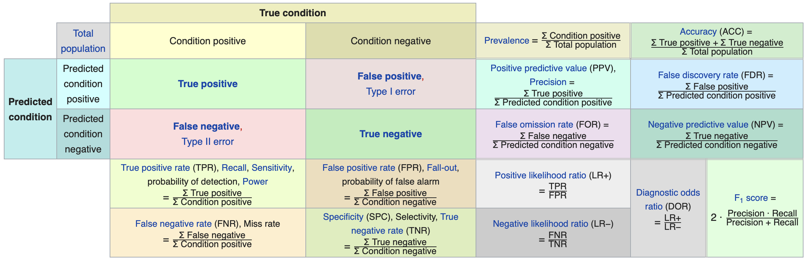

```{r setup, include = FALSE}
# Cartoons from https://github.com/allisonhorst/stats-illustrations
# dplyr based upon https://allisonhorst.shinyapps.io/dplyr-learnr/#section-welcome

source('../config.R')

library(gganimate)
library(magick)
library(cowplot)
library(DT)
source('../R/roc.R')
# library(titanic)
# data("titanic")
library(VisualStats)
# library(VisualMLE)
```

class: center, middle, inverse, title-slide

# `r metadata$title`
## `r metadata$subtitle`
### `r metadata$author`
### `r metadata$date`

---

# One Minute Paper Results

```{r, echo=FALSE, eval = TRUE}
library(googlesheets4)
omp <- read_sheet(one_minute_paper_results)
omp <- omp %>% dplyr::filter(Topic == 'Logistic Regression (Chapter 9)')
source('word_cloud.R')
```

.pull-left[
**What was the most important thing you learned during this class?**
```{r, echo=FALSE, fig.height=9, eval = TRUE}
ompWordCloud(omp$`What was the most important thing you learned during this class?`)
```
]
.pull-right[
**What important question remains unanswered for you?**
```{r, echo=FALSE, fig.height=9, eval = TRUE}
ompWordCloud(omp$`What important question remains unanswered for you?`)
```
]


```{r setup2, include=FALSE}
library(ggplot2)
library(grid)
library(VIM)
library(mice)
library(reshape2)

library(tree)
library(rpart)
library(party)
library(randomForest)
library(randomForestExplainer)
library(ggplot2)
library(mice)
library(ROCR)
library(TriMatch)
library(tidymodels)
library(caret)
library(patchwork)
library(ROCR)

par(mfrow = c(1,1), xpd = NA) #To prevent text from being clipped
par(bg="white", mai=c(1.2,1.5,1,1))

titanic <- read.csv('../course_data/titanic3.csv', stringsAsFactors = FALSE)
titanic$sex <- as.factor(titanic$sex)
titanic.mice <- mice::mice(titanic[,c("pclass","sex","age","sibsp")], m=1)
titanic <- cbind(survived=titanic$survived, mice::complete(titanic.mice))

titanic.split <- rsample::initial_split(titanic, strata = 'survived')
titanic.train <- rsample::training(titanic.split)
titanic.valid <- rsample::testing(titanic.split)

calif <- read.table('../course_data/cadata.dat', header=TRUE)
price.quintiles <- quantile(calif$MedianHouseValue, props = seq(0, 1, 0.2))
calif$cut.prices <- cut(calif$MedianHouseValue, price.quintiles, include.lowest=TRUE)
calif.split <- rsample::initial_split(calif, strata = 'cut.prices')
calif.train <- rsample::training(calif.split)
calif.valid <- rsample::testing(calif.split)

```

---
class: inverse, middle, center
# Classification and Regression Trees (CART)


---
# Classification and Regression Trees

The goal of CART methods is to find best predictor in X of some outcome, y. CART methods do this recursively using the following procedures:

* Find the best predictor in X for y.
* Split the data into two based upon that predictor.
* Repeat 1 and 2 with the split data sets until a stopping criteria has been reached.

There are a number of possible stopping criteria including: Only one data point remains.

* All data points have the same outcome value.
* No predictor can be found that sufficiently splits the data.

---
# Recursive Partitioning Logic of CART

.pull-left[
Consider the scatter plot to the right with the following characteristics:

* Binary outcome, G, coded “A” or “B”.
* Two predictors, x and z
* The vertical line at z = 3 creates the first partition.
* The double horizontal line at x = -4 creates the second partition.
* The triple horizontal line at x = 6 creates the third partition.
]
.pull-right[

]

---
# Tree Structure

.pull-left[
* The root node contains the full data set.
* The data are split into two mutually exclusive pieces. Cases where x > ci go to the right, cases where x <= ci go to the left.
* Those that go to the left reach a terminal node.
* Those on the right are split into two mutually exclusive pieces. Cases where z > c2 go to the right and terminal node 3; cases where z <= c2 go to the left and terminal node 2.
]
.pull-right[

]

---
# Sum of Squared Errors

The sum of squared errors for a tree *T* is:

$$S=\sum _{ c\in leaves(T) }^{  }{ \sum _{ i\in c }^{  }{ { (y-{ m }_{ c }) }^{ 2 } }  }$$

Where, ${ m }_{ c }=\frac { 1 }{ n } \sum _{ i\in c }^{  }{ { y }_{ i } }$, the prediction for leaf \textit{c}.

Or, alternatively written as:

$$S=\sum _{ c\in leaves(T) }^{  }{ { n }_{ c }{ V }_{ c } }$$

Where $V_{c}$ is the within-leave variance of leaf \textit{c}.

Our goal then is to find splits that minimize S.

---
# Advantages of CART Methods

* Making predictions is fast.

* It is easy to understand what variables are important in making predictions.

* Trees can be grown with data containing missingness. For rows where we cannot reach a leaf node, we can still make a prediction by averaging the leaves in the sub-tree we do reach.

* The resulting model will inherently include interaction effects. There are many reliable algorithms available.

---
# Regression Trees

In this example we will predict the median California house price from the house’s longitude and latitude.

```{r}
str(calif)
```

---
# Tree 1

```{r}
treefit <- tree(log(MedianHouseValue) ~ Longitude + Latitude, data=calif)
plot(treefit); text(treefit, cex=0.75)
```

---
# Tree 1

```{r, echo=FALSE, fig.height = 7}
price.deciles <- quantile(calif$MedianHouseValue, 0:9/9)
cut.prices <- cut(calif$MedianHouseValue, price.deciles, include.lowest=TRUE)
plot(calif$Longitude, calif$Latitude, col=grey(10:2/11)[cut.prices], pch=20, 
	 xlab="Longitude", ylab="Latitude")
partition.tree(treefit, ordvars=c("Longitude","Latitude"), add=TRUE)
```

---
# Tree 1

```{r}
summary(treefit)
```

Here “deviance” is the mean squared error, or root-mean-square error of $\sqrt{.166} =  0.41$.

---
# Tree 2, Reduce Minimum Deviance

We can increase the fit but changing the stopping criteria with the mindev parameter.

```{r}
treefit2 <- tree(log(MedianHouseValue) ~ Longitude + Latitude, data=calif, mindev=.001)
summary(treefit2)
```

With the larger tree we now have a root-mean-square error of 0.32.

---
# Tree 2, Reduce Minimum Deviance

```{r, echo=FALSE, fig.height = 7}
plot(calif$Longitude, calif$Latitude, col=grey(10:2/11)[cut.prices], 
pch=20, xlab="Longitude", ylab="Latitude")
partition.tree(treefit2, ordvars=c("Longitude","Latitude"), add=TRUE)
```

---
# Tree 3, Include All Variables

However, we can get a better fitting model by including the other variables.

```{r}
treefit3 <- tree(log(MedianHouseValue) ~ ., data=calif)
summary(treefit3)
```

With all the available variables, the root-mean-square error is 0.11.

---
# Classification Trees

Predicting who survived the Titanic.

* `pclass`: Passenger class (1 = 1st; 2 = 2nd; 3 = 3rd)
* `survival`: A Boolean indicating whether the passenger survived or not (0 = No; 1 = Yes); this is our target
* `name`: A field rich in information as it contains title and family names
* `sex`: male/female
* `age`: Age, a significant portion of values are missing
* `sibsp`: Number of siblings/spouses aboard
* `parch`: Number of parents/children aboard
* `ticket`: Ticket number.
* `fare`: Passenger fare (British Pound).
* `cabin`: Does the location of the cabin influence chances of survival?
* `embarked`: Port of embarkation (C = Cherbourg; Q = Queenstown; S = Southampton)
* `boat`: Lifeboat, many missing values
* `body`: Body Identification Number
* `home.dest`: Home/destination

---
# Classification using `rpart`

```{r}
(titanic.rpart <- rpart(survived ~ pclass + sex + age + sibsp,
   data=titanic.train))
```

---
# Classification using `rpart`

```{r}
plot(titanic.rpart); text(titanic.rpart, use.n=TRUE, cex=1)
```

---
# Classification using `ctree`

```{r}
(titanic.ctree <- ctree(survived ~ pclass + sex + age + sibsp, data=titanic.train))
```

---
# Classification using `ctree`

```{r}
plot(titanic.ctree)
```


---
# Ensemble Methods

Ensemble methods use multiple models that are combined by weighting, or averaging, each individual model to provide an overall estimate. Each model is a random sample of the sample. Common ensemble methods include:

* *Boosting* - Each successive trees give extra weight to points incorrectly predicted by earlier trees. After all trees have been estimated, the prediction is determined by a weighted “vote” of all predictions (i.e. results of each individual tree model).

* *Bagging* - Each tree is estimated independent of other trees. A simple “majority vote” is take for the prediction.

* *Random Forests* - In addition to randomly sampling the data for each model, each split is selected from a random subset of all predictors.

* *Super Learner* - An ensemble of ensembles. See https://cran.r-project.org/web/packages/SuperLearner/vignettes/Guide-to-SuperLearner.html

---
class: font90
# Random Forests

The random forest algorithm works as follows:

1. Draw $n_{tree}$ bootstrap samples from the original data.

2. For each bootstrap sample, grow an unpruned tree. At each node, randomly sample $m_{try}$ predictors and choose the best split among those predictors selected<footnote>Bagging is a special case of random forests where $m_{try} = p$ where *p* is the number of predictors</footnote>.

3. Predict new data by aggregating the predictions of the ntree trees (majority votes for classification, average for regression).

Error rates are obtained as follows:

1. At each bootstrap iteration predict data not in the bootstrap sample (what Breiman calls “out-of-bag”, or OOB, data) using the tree grown with the bootstrap sample.

2. Aggregate the OOB predictions. On average, each data point would be out-of-bag 36% of the times, so aggregate these predictions. The calculated error rate is called the OOB estimate of the error rate.

---
# Random Forests: Titanic

```{r titanicRF, cache=TRUE}
titanic.rf <- randomForest(factor(survived) ~ pclass + sex + age + sibsp,
						   data = titanic.train,
						   ntree = 5000,
						   importance = TRUE)
```

```{r}
importance(titanic.rf)
```

---
# Random Forests: Titanic (cont.)

```{r}
importance(titanic.rf)
```


---
# Random Forests: Titanic

```{r randomForestExplainer, cache=TRUE}
min_depth_frame <- min_depth_distribution(titanic.rf)
```


```{r, fig.width = 11, fig.height=5}
plot_min_depth_distribution(min_depth_frame)
```


---
class: inverse, middle, center
# Predictive Modeling

---
# Example: Hours Studying Predicting Passing

```{r}
study <- data.frame(
	Hours=c(0.50,0.75,1.00,1.25,1.50,1.75,1.75,2.00,2.25,2.50,2.75,3.00,
			3.25,3.50,4.00,4.25,4.50,4.75,5.00,5.50),
	Pass=c(0,0,0,0,0,0,1,0,1,0,1,0,1,0,1,1,1,1,1,1)
)
study[sample(nrow(study), 5),]
tab <- describeBy(study$Hours, group = study$Pass, mat = TRUE, skew = FALSE)
tab$group1 <- as.integer(as.character(tab$group1))
```


---
# Prediction

Odds (or probability) of passing if studied **zero** hours?

$$log(\frac{p}{1-p}) = -4.078 + 1.505 \times 0$$
$$\frac{p}{1-p} = exp(-4.078) = 0.0169$$
$$p = \frac{0.0169}{1.169} = .016$$

--

Odds (or probability) of passing if studied **4** hours?

$$log(\frac{p}{1-p}) = -4.078 + 1.505 \times 4$$
$$\frac{p}{1-p} = exp(1.942) = 6.97$$
$$p = \frac{6.97}{7.97} = 0.875$$

---
# Fitted Values

```{r}
study[1,]
logistic <- function(x, b0, b1) {
	return(1 / (1 + exp(-1 * (b0 + b1 * x)) ))
}
logistic(.5, b0=-4.078, b1=1.505)
```

---
# Model Performance

The use of statistical models to predict outcomes, typically on new data, is called predictive modeling. Logistic regression is a common statistical procedure used for prediction. We will utilize a **confusion matrix** to evaluate accuracy of the predictions.

```{r, echo=FALSE, out.width=1100}

```

---
class: font80
# Predicting Heart Attacks

Source: https://www.kaggle.com/datasets/imnikhilanand/heart-attack-prediction?select=data.csv

```{r, warning=FALSE}
heart <- read.csv('../course_data/heart_attack_predictions.csv')
heart <- heart |>
	mutate_if(is.character, as.numeric) |>
	select(!c(slope, ca, thal))
str(heart)
```

Note: `num` is the diagnosis of heart disease (angiographic disease status) (i.e. Value 0: < 50% diameter narrowing -- Value 1: > 50% diameter narrowing)


---
# Missing Data

We will save this for another day...

```{r, message = FALSE, warning = FALSE}
complete.cases(heart) |> table()
mice_out <- mice::mice(heart, m = 1)
heart <- mice::complete(mice_out)
```


---
# Data Setup

We will split the data into a training set (70% of observations) and validation set (30%).

```{r}
train.rows <- sample(nrow(heart), nrow(heart) * .7)
heart_train <- heart[train.rows,]
heart_test <- heart[-train.rows,]
```

This is the proportions of survivors and defines what our "guessing" rate is. That is, if we guessed no one had a heart attack, we would be correct 62% of the time.

```{r}
(heart_attack <- table(heart_train$num) %>% prop.table)
```

---
class: font80
# Model Training

```{r}
lr.out <- glm(num ~ ., data=heart_train, family=binomial(link = 'logit'))
summary(lr.out)
```

---
# Predicted Values

```{r}
heart_train$prediction <- predict(lr.out, type = 'response', newdata = heart_train)
ggplot(heart_train, aes(x = prediction, color = num == 1)) + geom_density()
```

---
# Results

```{r}
heart_train$prediction_class <- heart_train$prediction > 0.5
tab <- table(heart_train$prediction_class, 
			 heart_train$num) %>% prop.table() %>% print()
```

For the training set, the overall accuracy is `r round((tab[1,1] + tab[2,2]) * 100, digits = 2)`%. Recall that `r round(heart_attack[1] * 100, digits = 2)`% people did not have a heart attach. Therefore, the simplest model would be to predict that no one had a heart attack, which would mean we would be correct `r round(heart_attack[1] * 100, digits = 2)`% of the time. Therefore, our prediction model is `r  round((tab[1,1] + tab[2,2]) * 100 - heart_attack[1] * 100, digits = 2)`% better than guessing.

---
# Checking with the validation dataset

```{r}
(survived_test <- table(heart_test$num) %>% prop.table())
heart_test$prediction <- predict(lr.out, newdata = heart_test, type = 'response')
heart_test$prediciton_class <- heart_test$prediction > 0.5
tab_test <- table(heart_test$prediciton_class, heart_test$num) %>%
	prop.table() %>% print()
```

The overall accuracy is `r round((tab_test[1,1] + tab_test[2,2]) * 100, digits = 2)`%, or `r round( (tab_test[1,1] + tab_test[2,2] - max(survived_test) ) * 100, digits = 1)`% better than guessing.

---
class: font90
# Receiver Operating Characteristic (ROC) Curve

The ROC curve is created by plotting the true positive rate (TPR; AKA sensitivity) against the false positive rate (FPR; AKA probability of false alarm) at various threshold settings.

.pull-left[
In a classification model, outcomes are either as positive (*p*) or negative (*n*). There are then four possible outcomes:

* **true positive** (TP) The outcome from a prediction is *p* and the actual value is also *p*.
* **false positive** (FP) The actual value is *n*.
* **true negative** (TN) Both the prediction outcome and the actual value are *n*.
* **false negative** (FN) The prediction outcome is *n* while the actual value is *p*.

]
.pull-right[

```{r}
roc <- calculate_roc(heart_train$prediction, 
					 heart_train$num == 1)
summary(roc)
```

]


---
# ROC Curve

.center[

]

---
# ROC Curve

```{r}
plot(roc, curve = 'accuracy')
```

---
# ROC Curve

```{r}
plot(roc)
```


---
class: font90
# Caution on Interpreting Accuracy

- [Loh, Sooo, and Zing](http://cs229.stanford.edu/proj2016/report/LohSooXing-PredictingSexualOrientationBasedOnFacebookStatusUpdates-report.pdf) (2016) predicted sexual orientation based on Facebook Status.

- They reported model accuracies of approximately 90% using SVM, logistic regression and/or random forest methods.

--

- [Gallup](https://news.gallup.com/poll/234863/estimate-lgbt-population-rises.aspx) (2018) poll estimates that 4.5% of the Americal population identifies as LGBT.

--

- *My proposed model:* I predict all Americans are heterosexual.

- The accuracy of my model is 95.5%, or *5.5% better than Facebook's model!*

- Predicting "rare" events (i.e. when the proportion of one of the two outcomes large) is difficult and requires independent (predictor) variables that strongly associated with the dependent (outcome) variable.

---
# Fitted Values Revisited 

What happens when the ratio of true-to-false increases (i.e. want to predict "rare" events)?

Let's simulate a dataset where the ratio of true-to-false is 10-to-1. We can also define the distribution of the dependent variable. Here, there is moderate separation in the distributions.

```{r, echo = FALSE}
library(multilevelPSA)
getSimulatedData <- function(nvars=3,
							 ntreat=100, treat.mean=.6, treat.sd=.5,
							 ncontrol=1000, control.mean=.4, control.sd=.5) {
	if(length(treat.mean) == 1) { treat.mean = rep(treat.mean, nvars) }
	if(length(treat.sd) == 1) { treat.sd = rep(treat.sd, nvars) }
	if(length(control.mean) == 1) { control.mean = rep(control.mean, nvars) }
	if(length(control.sd) == 1) { control.sd = rep(control.sd, nvars) }
	
	df <- c(rep(0, ncontrol), rep(1, ntreat))
	for(i in 1:nvars) {
		df <- cbind(df, c(rnorm(ncontrol, mean=control.mean[i], sd=control.sd[i]),
						  rnorm(ntreat, mean=treat.mean[i], sd=treat.sd[i])))
	}
	df <- as.data.frame(df)
	names(df) <- c('treat', letters[1:nvars])
	return(df)
}
```

```{r message=FALSE, results = 'hide'}
test.df2 <- getSimulatedData(
	treat.mean=.6, control.mean=.4)
```

The `multilevelPSA::psrange` function will sample with varying ratios from 1:10 to 1:1. It takes multiple samples and averages the ranges and distributions of the fitted values from logistic regression.

```{r, results = 'hide'}
psranges2 <- psrange(test.df2, test.df2$treat, treat ~ .,
					 samples=seq(100,1000,by=100), nboot=20)
```

---
# Fitted Values Revisited (cont.)

```{r, fig.height = 7}
plot(psranges2)
```


---
class: left, font140
# One Minute Paper

.pull-left[
1. What was the most important thing you learned during this class?
2. What important question remains unanswered for you?
]
.pull-right[
```{r, echo=FALSE, fig.width=5, fig.height=5}
qrcode::qr_code(one_minute_paper) |> plot(col = c('#FAFAFA', 'black'))
```
]

`r one_minute_paper`
