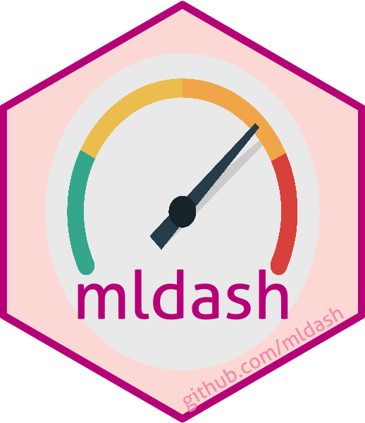

```{r setup, include = FALSE}
# Cartoons from https://github.com/allisonhorst/stats-illustrations
# dplyr based upon https://allisonhorst.shinyapps.io/dplyr-learnr/#section-welcome

source('../config.R')
library(fontawesome)
```


class: center, middle, inverse, title-slide

# `r metadata$title`
## `r metadata$subtitle`
### `r metadata$author`
### `r metadata$date`

---
# Final Exam

* Is now available on Brightspace.

* Due by midnight December 15th.

* You may use your book and course materials.

* We expect you to complete the exam on your own (i.e. do not discuss with classmates, colleagues, significant others, ChatGPT, etc.)

* There are two parts:
	1. Part one multiple choice questions and short answer questions.
	2. Part two has a small data set to analyze with R, then answer some interpretation questions.

* Put your answers in the Rmarkdown file and submit the PDF file. **Please do not post your answers online!**

---
# Jason's Work `r hexes('psa')`

My statistical research interest is in propensity score methods. Propensity score analysis (PSA) is a quasi-experimental design used to estimate causality from observational studies.

Here are some resources for PSA:

* PSA [Github repository](https://github.com/jbryer/psa) includes slides slides and Shiny application: https://github.com/jbryer/psa
* Early version of an [Intro to PSA](https://psa.bryer.org) book: https://psa.bryer.org
* Recording of a talk given in Fall 2023 for the NYC Meetup group here: https://www.youtube.com/watch?v=JLV4mtFhRMM


.pull-left[
 `multilevelPSA`<br/> [Multilevel PSA]((http://jason.bryer.org/multilevelPSA)
<br/><br/>
 `TriMatch`<br/> [Matching with non-binary treatments](http://jason.bryer.org/TriMatch)

]
.pull-right[
 `PSAboot`<br/> [Bootstrapping PSA](http://jason.bryer.org/PSAboot)
<br/><br/>
 `PSAgraphics`<br/> [Graphical analysis of PSA](http://jason.bryer.org/PSAgraphics)
]


---
# Jason's Work (cont.)

Here is list of some other R related projects I have worked on:

 [`likert`](https://github.com/jbryer/likert) - Analysis and Visualization of Likert Based Items  
 [`ShinyQDA`](https://github.com/jbryer/ShinyQDA) - R Package and Shiny Application for the Analysis of Qualitative Data  
 [`clav`](https://github.com/jbryer/clav) - Cluster Analysis Validation  
 [`IRRsim`](https://github.com/jbryer/IRRsim) - An R Package for Simulating Inter-Rater Reliability  
 [`mldash`](https://github.com/jbryer/mldash) - Machine Learning Dashboard  
 [AmplifyApp](https://amplifyapp.org/en), [dashboard](https://amplifyapp.org/en), and [Future Mapping NYC](https://futuremapping.org)

---
# DAACS (Jason and Angela)

[The Diagnostic Assessment and Achievement of College Skills](https://daacs.net) (DAACS) is a suite of technological and social supports to optimize student learning. DAACS  provides personalized feedback about students’ strengths and weaknesses in  terms of key academic and self-regulated learning skills, linking them to the resources to help them be successful students. This is currently supported by a five-year $3.8 million grant received in 2021 from the Institute of Education Sciences to test the efficacy at three institutions.

Applications of Data Science:

* We use natural language processing and predictive models to machine score the essays.
  * We had a student this semester work with us to explore whether we can detect AI generated essays specific to the DAACS writing prompt (answer: we)
* We use DAACS data to estimate "risk scores" for students failing so we can target them with resources to help them be successful.
  * Related to this, we have developed a new R package for estimated predictive models with missing data, see [medley](https://github.com/jbryer/medley).


---
# Angela's Work: Students’ responses to feedback

.center[
```{r, echo=FALSE, out.width=800}

```
]

---
# Exploring Responses to Feedback in DAACS

**Some Research Questions**

1. What are the sentiments conveyed in students’ essays?
2. What judgments about SRL feedback emerge in students’ essays?
3. What meanings do students make of the SRL feedback? (a focus on the content criterion?)
4. What attributions do students make if any?
5. To what strategies do students tend to commit? 
6. Are these (above five bullets) related to 1) the number of dots they received per domain? 2) the number of feedback pages they viewed? 3) the level of feedback specificity they viewed?

**Data Sources**

* Students’ essays on the DAACS Writing Assessment
* Students’ SRL Assessment Results and Feedback

**Analyses**

* Sentiment Analysis
* Content Analysis

---
# George: Data and Models in Biogeochemistry 

.pull-left[

- Metagenomes/Systems Bio

- Ecology and Traits

- Physical Oceanography

- Bayesian Inference

- Understand the response to environmental drivers like climate change

]
.pull-right[


]

---
# Critical Transitions


- Revolutions, Economic Booms/Busts, Tech Adoption, Desertification

- Statistical Phyics. for indicators of change

- Combine theory and data from Social/Economic Systems


---
# Other Areas

- Past: collective behavior, plasma physics, geophysical fluid dynamics, and numerical analysis.

- Happy to help you with any ideas even tangentially related to these areas

- Future interest: Random Numerical Methods eg Hamiltonian MCMC methods, random linear algebra


---
# Thank You

This has been a great semester. Please don't hesitate to reach out:

.pull-left[
`r fa('envelope')` Email: [jason.bryer@cuny.edu](mailto:jason.bryer@cuny.edu)
`r fa('github')` Github: https://github.com/jbryer
`r fa('link')` Personal Website: https://bryer.org
`r fa('linkedin')` LinkedIn: [jasonbryer](https://www.linkedin.com/in/jasonbryer/)
`r fa('mastodon')` Mastodon: [@jbryer@vis.social](https://vis.social/@jbryer)

]
.pull-right[
`r fa('envelope')` Email: [angela.lui@cuny.edu](mailto:angela.lui@cuny.edu)
`r fa('linkedin')` LinkedIn: [angela-m-lui-8b051928](https://www.linkedin.com/in/angela-m-lui-8b051928/)

<hr />

`r fa('envelope')` Email: [george.hagstrom@cuny.edu](mailto:george.hagstrom@cuny.edu)
`r fa('linkedin')` LinkedIn: [george-hagstrom-846b1b13](https://www.linkedin.com/in/george-hagstrom-846b1b13/)
]

<br/>

You can download all course materials on [Github](https://github.com/jbryer/`r github_link`). Click the [clone or download](https://github.com/jbryer/`r github_link`/archive/master.zip) link to download a zip file.

